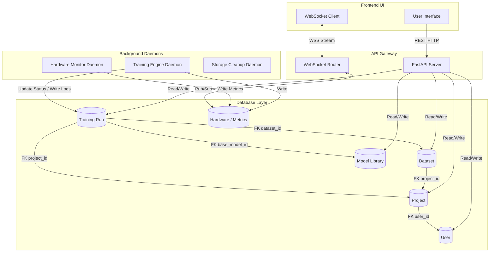
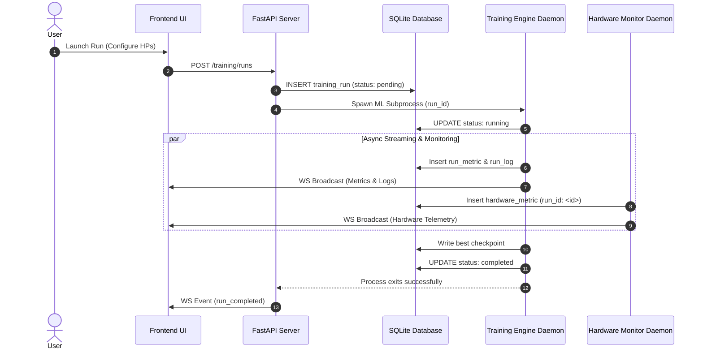
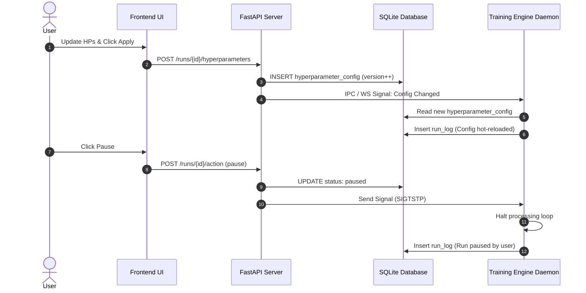

# Backend Integration Architecture & End-to-End User Workflow Specification

This document establishes the operational relationships, state machines, and end-to-end user journeys for the system's backend modules. It serves as the definitive reference for cross-module integration.

## 1. System Module Interrelationship Matrix & Dependency Graph

### 1.1 Dependency Mapping & Scope Inheritance

The backend system is composed of several interdependent modules, linked hierarchically via Foreign Key constraints to ensure strict multi-tenant isolation and context propagation.

*   **User Module**: The root identity.
*   **Project Management Module**: Inherits `user_id`. Acts as the primary tenancy boundary.
*   **Datasets Module**: Inherits `project_id`. Datasets belong to specific projects.
*   **Model Library Module**: Globally accessible (public base models), but tracks user interactions (`user_id` for stars/forks).
*   **Training Execution Module**: Inherits `project_id`, `user_id`, `dataset_id`, and `base_model_id`. Represents the core integration point of all other modules.
*   **Hardware Monitoring Module**: Inherits `run_id` to link telemetry data to active training jobs. If `run_id` is null, it tracks system-level idle metrics.

### 1.2 Inter-Service Communication Channels

1.  **FastAPI REST API**: Synchronous operations (CRUD, context switching, config updates).
2.  **WebSockets**: Real-time asynchronous streaming of terminal logs (`run_log`), training metrics (`run_metric`), and hardware telemetry to the frontend.
3.  **Database Transactions**: SQLite atomicity for state transitions.
4.  **Background Daemons / IPC**:
    *   **Training Engine Daemon**: Spawns sub-processes for ML execution. Communicates via IPC (signals/pipes) or local socket.
    *   **Hardware Monitor Daemon**: Polls GPU/CPU metrics periodically.

### 1.3 System Boundaries Dependency Graph (Mermaid)

## 2. End-to-End Backend User Workflows (Sequence & State Processing)

### Workflow 1: Complete Training Pipeline (Create Project -> Select Assets -> Launch Run -> Live Monitor)

1.  **Step 1: Project Creation**
    *   **Frontend Action**: User creates a new project.
    *   **API Endpoint**: `POST /api/projects`
    *   **Database Transaction**: Insert into `project` table, set active `project_id` context in the frontend session.
    *   **Background System Reaction**: None.
2.  **Step 2: Asset Selection**
    *   **Frontend Action**: User selects a Base Model from the Library and a Dataset from the Catalog.
    *   **API Endpoint**: `GET /api/models` & `GET /api/datasets?project_id=<id>`
    *   **Database Transaction**: Read `model` and `dataset` entities (filtered by `project_id`).
    *   **Background System Reaction**: None.
3.  **Step 3: Launch Run**
    *   **Frontend Action**: User configures hyperparameters and clicks "Launch Run".
    *   **API Endpoint**: `POST /api/training/runs`
    *   **Database Transaction**: Insert `training_run` (status: `pending`), linked to `project_id`, `base_model_id`, `dataset_id`. Insert `hyperparameter_config`.
    *   **Background System Reaction**: FastAPI signals the Training Engine daemon to start processing.
4.  **Step 4: Training Execution & Streaming**
    *   **Frontend Action**: User opens the Live Monitor page.
    *   **API Endpoint / WebSocket Event**: Connect to `ws://api/training/ws/run/<run_id>`.
    *   **Database Transaction**: Training Engine updates `training_run.status` to `running`. Engine continually inserts to `run_metric` and `run_log`.
    *   **Background System Reaction**: WSRouter broadcasts inserted logs/metrics to connected frontend clients.
5.  **Step 5: Hardware Telemetry Binding**
    *   **Frontend Action**: User views the Hardware Monitoring tab.
    *   **API Endpoint / WebSocket Event**: Connect to `ws://api/hardware/ws`.
    *   **Database Transaction**: Hardware Monitor inserts into `hardware_metric`. Because a run is active, metrics are linked via `hardware_metric.run_id = <uuid>`, replacing the system idle metrics (`run_id IS NULL`).
    *   **Background System Reaction**: Hardware metrics are streamed to the frontend.
6.  **Step 6: Completion & Checkpointing**
    *   **Frontend Action**: Run reaches 100%.
    *   **API Endpoint / WebSocket Event**: Receive `run_completed` event via WebSocket.
    *   **Database Transaction**: Training engine inserts final `checkpoint` record. Updates `training_run.status` to `completed`.
    *   **Background System Reaction**: GPU locks are released. Best checkpoint file is auto-saved to disk. Hardware Monitor reverts to idle mode (`run_id IS NULL`).

### Workflow 2: Dynamic Mid-Run Management & Parameter Tuning

1.  **Step 1: Update Hyperparameters**
    *   **Frontend Action**: User updates hyperparameters mid-run and clicks "Apply".
    *   **API Endpoint**: `POST /api/training/runs/<id>/hyperparameters`
    *   **Database Transaction**: Backend creates a new versioned `hyperparameter_config` record.
    *   **Background System Reaction**: FastAPI issues an IPC/WebSocket signal to the Training Engine daemon to hot-reload parameters on the next epoch.
2.  **Step 2: Signal Training Engine**
    *   **Frontend Action**: None.
    *   **API Endpoint / WebSocket Event**: IPC signal.
    *   **Database Transaction**: Engine acknowledges by logging a `run_log` entry ("Hyperparameters updated").
    *   **Background System Reaction**: Engine applies new configurations.
3.  **Step 3: Pause/Resume/Stop Controls**
    *   **Frontend Action**: User clicks Pause, Resume, or Stop.
    *   **API Endpoint**: `POST /api/training/runs/<id>/action` (Payload: `action=pause|resume|stop`)
    *   **Database Transaction**: Atomic update of `training_run.status` (`running` <-> `paused` -> `stopped`).
    *   **Background System Reaction**: FastAPI sends OS signal (e.g., SIGTSTP for pause, SIGCONT for resume, SIGTERM for stop) to the daemon subprocess. Daemon intercepts, alters processing loop, and (if stopping) triggers graceful teardown.

### Workflow 3: Project Context Switching & Multi-Project Data Isolation

1.  **Step 1: Switch Context**
    *   **Frontend Action**: User switches active project context via top-navigation dropdown.
    *   **API Endpoint**: Client begins sending the new `Project-ID` context header.
    *   **Database Transaction**: None immediately.
    *   **Background System Reaction**: Backend middleware invalidates current session scope.
2.  **Step 2: Enforce Tenancy Isolation**
    *   **Frontend Action**: User views Run List or Catalog.
    *   **API Endpoint**: HTTP queries.
    *   **Database Transaction**: All subsequent backend queries strictly enforce `WHERE project_id = <active_id>` isolation filters across runs, datasets, models, and associated hardware telemetry.

## 3. System State Machine & Database Lifecycle Matrix

### 3.1 Training Run State Transition Matrix

The core entity `training_run.status` adheres to a strict state machine to govern the lifecycle of ML workloads.

| Current State | Target State | Permitted Actor | Description |
| :--- | :--- | :--- | :--- |
| `None` | `pending` | User via API | Run is created and queued for execution. |
| `pending` | `running` | Training Engine | Daemon picks up the run and acquires hardware resources. |
| `running` | `paused` | User via API | User explicitly pauses execution mid-run. |
| `running` | `stopped` | User via API | User forcibly halts the run. |
| `running` | `completed` | Training Engine | Run finishes all epochs successfully. |
| `running` | `failed` | Watchdog / Engine | Crash, OOM kill, or unhandled exception occurs. |
| `paused` | `running` | User via API | User resumes the run. |
| `paused` | `stopped` | User via API | User aborts a paused run. |

*Note: Terminal states (`completed`, `stopped`, `failed`) cannot transition to any other state.*

### 3.2 Hardware Metric Lifecycle

| Engine State | Hardware Record `run_id` | Semantics |
| :--- | :--- | :--- |
| No active runs | `NULL` | Hardware monitor records system idle metrics. |
| Active run exists | `<run_uuid>` | Hardware monitor links dynamic telemetry ticks to the specific run. |

## 4. Detailed Sequence Diagrams

### Workflow 1: Complete Training Pipeline

### Workflow 2: Dynamic Mid-Run Management

## 5. Cross-Module Error Propagation & Edge-Case Handling

### 5.1 Daemon Crashes & Zombie Runs (Watchdog Pattern)
**Risk**: If the Training Engine daemon crashes ungracefully (e.g., OOM killed by OS, power failure), the `training_run.status` will permanently remain `running`. Hardware monitors might continue trying to sample telemetry, and the frontend will stall.
**Resolution**: 
Implement a **Heartbeat Watchdog**. The Training Engine must periodically touch an `updated_at` column on the run. A Watchdog daemon sweeps for `running` runs whose `updated_at` is older than a specified threshold. If detected, it forces a state transition to `failed`, logs a system error, and explicitly releases GPU locks to clear the environment for the next run.

### 5.2 Transaction Rollbacks & Orphaned File Cleanup
**Risk**: Database cascades (e.g., deleting a Project cascade-deletes Datasets and Runs) remove relational records, but SQLite `ON DELETE CASCADE` does not interact with the local filesystem, leaving physical data (images, checkpoints, models) permanently orphaned.
**Resolution**: 
Institute a **Storage Cleanup Daemon** (or SQLAlchemy `after_delete` event hooks). When a cascade deletes a `Dataset`, `Checkpoint`, or `DatasetUpload`, the hook automatically removes the associated `storage_path` or `file_path` from the physical disk, maintaining strict parity between the DB state and the filesystem.

### 5.3 Checkpoint Race Conditions on Stop
**Risk**: If a user hits "Stop" exactly when the engine is flushing a large multi-gigabyte checkpoint to disk, a `SIGKILL` would result in corrupted checkpoint files and a dirty state.
**Resolution**:
Backend APIs issue a graceful termination signal (`SIGTERM`). The Training Engine's signal handler intercepts this, completes any active atomic file writes (e.g., writing to a `.tmp` file and then executing a fast atomic rename to the target path), synchronizes the final state to the Database, and only then allows the daemon to exit securely.
