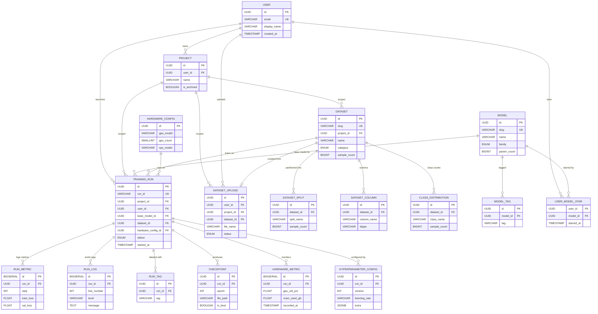

# ML-Tools — Logical Data Dictionary

> Extracted from the frontend UI in [App.tsx](file:///c:/Users/PC/Desktop/ml-tools/frontend/src/app/App.tsx).
> **5 screens analysed**: Dashboard, Experiments, Models, Hardware, Datasets.

---

## Entity-Relationship Overview

---

## 1 · `training_run` — Core experiment entity

> **UI source**: Experiments table, Dashboard "Recent Runs", expanded detail row, top bar stat badges.

| Column | Type | Nullable | UI Field | Notes |
|---|---|---|---|---|
| `id` | `UUID` / `PK` | ✗ | — | Internal surrogate key |
| `run_id` | `VARCHAR(20)` | ✗ | Run ID (`run-0091`) | User-facing short ID, unique |
| `name` | `VARCHAR(120)` | ✗ | Name (`convnext-xl-finetune`) | Human-readable label |
| `epochs_total` | `INT` | ✗ | Epochs (denominator) | |
| `epochs_completed` | `INT` | ✗ | Epochs (numerator) | |
| `best_val_acc` | `FLOAT` | ✓ | Best Val Acc | 0–1 · *Deliberate denorm — avoids full `run_metric` scan* |
| `best_val_loss` | `FLOAT` | ✓ | Best Val Loss | *Deliberate denorm* |
| `train_acc` | `FLOAT` | ✓ | Train Acc (final) | *Deliberate denorm* |
| `train_loss` | `FLOAT` | ✓ | Train Loss (final) | *Deliberate denorm* |
| `training_time_sec` | `INT` | ✓ | Train Time | Displayed as `Xh Ym` |
| `param_count` | `VARCHAR(20)` | ✓ | Parameters | e.g. `350M` |
| `status` | `ENUM('completed','running','failed','stopped')` | ✗ | Status chip | |
| `started_at` | `TIMESTAMP` | ✗ | Started | |

> [!IMPORTANT]
> **Hidden system metadata** (not visible on UI but required):

| Column | Type | Notes |
|---|---|---|
| `project_id` | `UUID` / `FK` | Multi-project isolation |
| `user_id` | `UUID` / `FK` | Who launched the run |
| `base_model_id` | `UUID` / `FK` | FK → `model` when "Use as Base" is clicked |
| `dataset_id` | `UUID` / `FK` | FK → `dataset` |
| `hardware_config_id` | `UUID` / `FK` | FK → `hardware_config`; links run to machine spec shown in Hardware Monitor header |
| `finished_at` | `TIMESTAMP` | Compute duration server-side; needed for stopped/failed |
| `error_message` | `TEXT` | Store failure reason for `status = 'failed'` |
| `checkpoint_path` | `VARCHAR(512)` | For "Download Checkpoint" action |
| `config_json` | `JSONB` | Full hyperparams snapshot for "Load Config" action |
| `created_at` | `TIMESTAMP` | Row creation |
| `updated_at` | `TIMESTAMP` | Last status/metric update |
| `is_deleted` | `BOOLEAN` | Soft-delete flag |

---

## 2 · `run_tag` — Tags on runs

> **UI source**: Tag badges under run name (`finetune`, `best`, `distill`, etc.)

| Column | Type | Nullable | Notes |
|---|---|---|---|
| `id` | `UUID` / `PK` | ✗ | |
| `run_id` | `UUID` / `FK` | ✗ | → `training_run` |
| `tag` | `VARCHAR(40)` | ✗ | e.g. `finetune`, `best` |

> Unique constraint on (`run_id`, `tag`).

---

## 3 · `run_metric` — Time-series training metrics

> **UI source**: Dashboard loss/accuracy charts (step × trainLoss × valLoss × trainAcc × valAcc), sparkline in Experiments table.

| Column | Type | Nullable | Notes |
|---|---|---|---|
| `id` | `BIGSERIAL` / `PK` | ✗ | High-cardinality, use serial |
| `run_id` | `UUID` / `FK` | ✗ | → `training_run` |
| `step` | `INT` | ✗ | Global step counter |
| `train_loss` | `FLOAT` | ✗ | |
| `val_loss` | `FLOAT` | ✓ | Only logged on eval steps |
| `train_acc` | `FLOAT` | ✗ | |
| `val_acc` | `FLOAT` | ✓ | Only logged on eval steps |
| `recorded_at` | `TIMESTAMP` | ✗ | Server receipt time |

> [!TIP]
> **Partitioning**: HASH partition by `run_id` (32 buckets). Add a covering index `(run_id, step) INCLUDE (train_loss, val_loss, train_acc, val_acc)` for index-only chart scans. Consider TimescaleDB hypertable for auto-compression. Pre-compute sparklines via materialized view (`mv_run_sparkline` — last 50 points per run, refreshed concurrently after each epoch).

---

## 4 · `run_log` — Training log lines

> **UI source**: Dashboard terminal panel (scrolling log), color-coded by prefix (TRAIN / VAL / GPU / INFO).

| Column | Type | Nullable | Notes |
|---|---|---|---|
| `id` | `BIGSERIAL` / `PK` | ✗ | |
| `run_id` | `UUID` / `FK` | ✗ | → `training_run` |
| `line_number` | `INT` | ✗ | Ordering |
| `level` | `VARCHAR(10)` | ✗ | `TRAIN`, `VAL`, `GPU`, `INFO` |
| `message` | `TEXT` | ✗ | Full log line |
| `logged_at` | `TIMESTAMP` | ✗ | Original timestamp from log |

> [!TIP]
> **Partitioning**: HASH partition by `run_id` (32 buckets). Index: `(run_id, line_number DESC)` for terminal tail queries. Cache last 200 lines in Redis list `run:{id}:logs:tail` for live-streaming via WebSocket.

---

## 5 · `hardware_metric` — Time-series hardware telemetry

> **UI source**: Hardware Monitor screen (GPU util gauges, VRAM, RAM, CPU area charts, temperature heatmap, disk I/O, network I/O, power draw). Also Dashboard sidebar utilisation bars.

| Column | Type | Nullable | Notes |
|---|---|---|---|
| `id` | `BIGSERIAL` / `PK` | ✗ | |
| `run_id` | `UUID` / `FK` | ✓ | Optional — system-level when idle |
| `epoch` | `INT` | ✓ | Maps to epoch timeline slider |
| `gpu_index` | `SMALLINT` | ✗ | 0–3 (multi-GPU) |
| `gpu_util_pct` | `FLOAT` | ✗ | 0–100 |
| `gpu_temp_c` | `FLOAT` | ✗ | Celsius |
| `gpu_power_w` | `FLOAT` | ✓ | Watts |
| `vram_used_gb` | `FLOAT` | ✗ | |
| `vram_total_gb` | `FLOAT` | ✗ | |
| `cpu_util_pct` | `FLOAT` | ✗ | |
| `ram_used_gb` | `FLOAT` | ✗ | |
| `ram_total_gb` | `FLOAT` | ✗ | |
| `disk_read_gbps` | `FLOAT` | ✓ | |
| `disk_write_gbps` | `FLOAT` | ✓ | |
| `net_rx_gbps` | `FLOAT` | ✓ | |
| `net_tx_gbps` | `FLOAT` | ✓ | |
| `recorded_at` | `TIMESTAMP` | ✗ | |

> [!TIP]
> **Partitioning**: HASH partition by `run_id` (32 buckets). BRIN index on `recorded_at` for timeline slider range queries. Cache latest snapshot in Redis hash `run:{id}:hw` (30s TTL) for live gauge rendering.

> [!NOTE]
> **Hidden system metadata**: The Hardware view header displays the hardware spec string (`4× NVIDIA A100 80GB · 32-core Xeon · 512GB DDR5 · NVMe RAID-0`). This implies a `hardware_config` entity or a config column on the run/project level.

---

## 6 · `model` — Model library / architecture registry

> **UI source**: Model Library card grid, architecture modal, "Use as Base" action.

| Column | Type | Nullable | UI Field | Notes |
|---|---|---|---|---|
| `id` | `UUID` / `PK` | ✗ | — | |
| `slug` | `VARCHAR(60)` | ✗ | — | URL-safe ID (`efficientnet-b4`) |
| `name` | `VARCHAR(60)` | ✗ | Card title | Short name |
| `full_name` | `VARCHAR(120)` | ✗ | Modal title | |
| `family` | `ENUM('CNN','Transformer','Segmentation','Detection','Lightweight','Multimodal','Classical')` | ✗ | Family badge | |
| `param_count` | `BIGINT` | ✓ | Params | Raw count (e.g. `350000000`); API formats as `350M` |
| `flops` | `BIGINT` | ✓ | FLOPs | Raw count (e.g. `4200000000`); API formats as `4.2B` |
| `top1_acc` | `FLOAT` | ✓ | Top-1 | 0–1 (e.g. `0.830`); API formats as `83.0%` |
| `input_size` | `VARCHAR(20)` | ✓ | Input | `380×380`, `Tabular` |
| `depth` | `INT` | ✓ | Depth / Estimators | Layer count |
| `source` | `VARCHAR(40)` | ✓ | Source | `Google`, `Meta AI` |
| `description` | `TEXT` | ✓ | Description paragraph | |
| `fork_count` | `INT` | ✗ | Forks | Community usage metric |

> [!IMPORTANT]
> **Hidden system metadata**:

| Column | Type | Notes |
|---|---|---|
| `architecture_svg` | `TEXT` | Could store the diagram type or thumbnail asset path |
| `download_url` | `VARCHAR(512)` | For "Download" button in modal |
| `weight_path` | `VARCHAR(512)` | Pretrained weights location |
| `created_at` | `TIMESTAMP` | |
| `updated_at` | `TIMESTAMP` | |
| `is_public` | `BOOLEAN` | Visibility flag |

---

## 7 · `model_tag`

> **UI source**: Tag chips on model cards (`classification`, `pretrained`, `scalable`, etc.)

| Column | Type | Nullable | Notes |
|---|---|---|---|
| `id` | `UUID` / `PK` | ✗ | |
| `model_id` | `UUID` / `FK` | ✗ | → `model` |
| `tag` | `VARCHAR(40)` | ✗ | |

---

## 8 · `user_model_star` — Per-user starred models

> **UI source**: Star icon on model cards (toggleable, persists per user).

| Column | Type | Nullable | Notes |
|---|---|---|---|
| `user_id` | `UUID` / `FK` | ✗ | |
| `model_id` | `UUID` / `FK` | ✗ | |
| `starred_at` | `TIMESTAMP` | ✗ | |

> PK: (`user_id`, `model_id`)

---

## 9 · `dataset` — Dataset registry

> **UI source**: Datasets left sidebar list, preview panel header, overview tab.

| Column | Type | Nullable | UI Field | Notes |
|---|---|---|---|---|
| `id` | `UUID` / `PK` | ✗ | — | |
| `slug` | `VARCHAR(40)` | ✗ | — | `imagenet`, `coco` |
| `name` | `VARCHAR(80)` | ✗ | List item title | `ImageNet-1K` |
| `category` | `ENUM('Image','Text','Tabular','Audio')` | ✗ | Category chip | |
| `sample_count` | `BIGINT` | ✗ | Samples | |
| `disk_size` | `VARCHAR(20)` | ✗ | Size | `138 GB` |
| `format` | `VARCHAR(20)` | ✗ | Format badge | `JPEG`, `CSV`, `MP3` |
| `class_count` | `INT` | ✗ | Classes | |
| `feature_count` | `INT` | ✗ | Features | |
| `description` | `TEXT` | ✓ | Description under header | |

> [!IMPORTANT]
> **Hidden system metadata**:

| Column | Type | Notes |
|---|---|---|
| `project_id` | `UUID` / `FK` | Scoping |
| `storage_path` | `VARCHAR(512)` | Actual location on disk / object store |
| `is_preloaded` | `BOOLEAN` | System-supplied vs. user-uploaded |
| `uploaded_by` | `UUID` / `FK` | For user uploads |
| `created_at` | `TIMESTAMP` | |
| `updated_at` | `TIMESTAMP` | |
| `is_deleted` | `BOOLEAN` | Soft-delete |

---

## 10 · `dataset_split`

> **UI source**: Split badges in preview header (`train`, `val`, `test`).

| Column | Type | Nullable | Notes |
|---|---|---|---|
| `id` | `UUID` / `PK` | ✗ | |
| `dataset_id` | `UUID` / `FK` | ✗ | → `dataset` |
| `split_name` | `VARCHAR(20)` | ✗ | `train`, `val`, `test`, `dev`, `full` |
| `sample_count` | `BIGINT` | ✓ | Per-split count |

---

## 11 · `dataset_column` — Schema definition

> **UI source**: Datasets → Schema tab (Column, Type, Non-Null, Mean, Min, Max).

| Column | Type | Nullable | UI Field | Notes |
|---|---|---|---|---|
| `id` | `UUID` / `PK` | ✗ | — | |
| `dataset_id` | `UUID` / `FK` | ✗ | — | |
| `column_name` | `VARCHAR(60)` | ✗ | Column | |
| `dtype` | `VARCHAR(40)` | ✗ | Type | `float64`, `PIL.Image`, `int64` |
| `non_null_count` | `BIGINT` | ✗ | Non-Null | |
| `stat_mean` | `VARCHAR(20)` | ✓ | Mean | |
| `stat_min` | `VARCHAR(20)` | ✓ | Min | |
| `stat_max` | `VARCHAR(20)` | ✓ | Max | |
| `ordinal` | `SMALLINT` | ✗ | — | Display order |

---

## 12 · `class_distribution` — Per-class sample counts

> **UI source**: Datasets → Overview tab bar chart.

| Column | Type | Nullable | Notes |
|---|---|---|---|
| `id` | `UUID` / `PK` | ✗ | |
| `dataset_id` | `UUID` / `FK` | ✗ | |
| `class_name` | `VARCHAR(60)` | ✗ | Bar label |
| `sample_count` | `BIGINT` | ✗ | Bar value |
| `ordinal` | `SMALLINT` | ✗ | Display order |

---

## 13 · `dataset_upload` — User file uploads

> **UI source**: Datasets → Upload Hub (right panel), drag-and-drop zone, upload queue with progress bars.

| Column | Type | Nullable | UI Field | Notes |
|---|---|---|---|---|
| `id` | `UUID` / `PK` | ✗ | — | |
| `file_name` | `VARCHAR(255)` | ✗ | File name | |
| `file_size_bytes` | `BIGINT` | ✗ | Size | Displayed as `X.X MB` |
| `upload_progress_pct` | `FLOAT` | ✗ | Progress bar | 0–100 |
| `status` | `ENUM('uploading','validating','valid','error')` | ✗ | Status chip | |

> [!IMPORTANT]
> **Hidden system metadata**:

| Column | Type | Notes |
|---|---|---|
| `user_id` | `UUID` / `FK` | Uploader |
| `project_id` | `UUID` / `FK` | Scoping |
| `mime_type` | `VARCHAR(60)` | Detected content type |
| `storage_key` | `VARCHAR(512)` | S3/GCS key or local path |
| `dataset_id` | `UUID` / `FK` | Linked dataset after validation |
| `error_detail` | `TEXT` | Reason when `status = 'error'` |
| `started_at` | `TIMESTAMP` | Upload start time |
| `completed_at` | `TIMESTAMP` | Upload/validation finish |
| `created_at` | `TIMESTAMP` | |

---

## 14 · `hyperparameter_config` — Dashboard hyper-param form

> **UI source**: Dashboard right sidebar "Hyperparameters" panel with editable fields + "Apply" button.

| Column | Type | Nullable | UI Field | Notes |
|---|---|---|---|---|
| `id` | `UUID` / `PK` | ✗ | — | |
| `run_id` | `UUID` / `FK` | ✗ | — | → `training_run` |
| `learning_rate` | `VARCHAR(20)` | ✗ | Learning Rate | `5e-4` |
| `batch_size` | `VARCHAR(10)` | ✗ | Batch Size | |
| `optimizer` | `VARCHAR(20)` | ✗ | Optimizer | |
| `scheduler` | `VARCHAR(40)` | ✓ | Scheduler | `OneCycleLR` |
| `momentum` | `VARCHAR(10)` | ✓ | Momentum | |
| `weight_decay` | `VARCHAR(20)` | ✓ | Weight Decay | |
| `dropout` | `VARCHAR(10)` | ✓ | Dropout | |
| `epochs` | `VARCHAR(10)` | ✗ | Epochs | |
| `warmup_steps` | `VARCHAR(10)` | ✓ | Warmup Steps | |
| `grad_clip` | `VARCHAR(10)` | ✓ | Grad Clip | |
| `extra` | `JSONB` | ✗ | — | `DEFAULT '{}'` · Overflow for custom/experimental hyperparams (e.g. `label_smoothing`, `mixup_alpha`). GIN-indexed. API merges with fixed fields into flat JSON response. |
| `version` | `INT` | ✗ | — | Increments on "Apply" |

> [!NOTE]
> **Hybrid storage**: Fixed relational columns serve the Dashboard sidebar form (typed inputs, direct column binding). The `extra` JSONB column absorbs any custom params without schema migration. `training_run.config_json` remains as an immutable snapshot frozen at run start for "Load Config" / "Clone Run" actions — complementary, not redundant.

---

## 15 · `checkpoint` — Saved model checkpoints

> **UI source**: "Download Checkpoint" action in Experiments expanded row, log line `Checkpoint saved → ./checkpoints/…`.

| Column | Type | Nullable | Notes |
|---|---|---|---|
| `id` | `UUID` / `PK` | ✗ | |
| `run_id` | `UUID` / `FK` | ✗ | → `training_run` |
| `epoch` | `INT` | ✗ | Which epoch this checkpoint was saved at |
| `file_path` | `VARCHAR(512)` | ✗ | Storage path |
| `file_size_bytes` | `BIGINT` | ✓ | |
| `val_acc` | `FLOAT` | ✓ | Metric at checkpoint time |
| `val_loss` | `FLOAT` | ✓ | |
| `is_best` | `BOOLEAN` | ✗ | `new best val_acc` flag in logs |
| `created_at` | `TIMESTAMP` | ✗ | |

---

## Hidden Infrastructure Entities

These aren't directly visible on any screen but are **required** to make the multi-user, multi-project UI functional:

### 16 · `user`

| Column | Type | Notes |
|---|---|---|
| `id` | `UUID` / `PK` | |
| `email` | `VARCHAR(255)` | Unique |
| `display_name` | `VARCHAR(80)` | |
| `password_hash` | `VARCHAR(255)` | |
| `avatar_url` | `VARCHAR(512)` | |
| `created_at` | `TIMESTAMP` | |
| `last_login_at` | `TIMESTAMP` | |
| `is_active` | `BOOLEAN` | |

### 17 · `project`

| Column | Type | Notes |
|---|---|---|
| `id` | `UUID` / `PK` | |
| `user_id` | `UUID` / `FK` | Owner |
| `name` | `VARCHAR(120)` | |
| `description` | `TEXT` | |
| `created_at` | `TIMESTAMP` | |
| `updated_at` | `TIMESTAMP` | |
| `is_archived` | `BOOLEAN` | |

### 18 · `hardware_config` — Machine spec registry

> Supports the Hardware Monitor header: `4× NVIDIA A100 80GB · 32-core Xeon · 512GB DDR5 · NVMe RAID-0`

| Column | Type | Notes |
|---|---|---|
| `id` | `UUID` / `PK` | |
| `gpu_model` | `VARCHAR(40)` | `NVIDIA A100 80GB` |
| `gpu_count` | `SMALLINT` | `4` |
| `cpu_model` | `VARCHAR(60)` | `32-core Xeon` |
| `ram_total_gb` | `INT` | `512` |
| `storage_type` | `VARCHAR(40)` | `NVMe RAID-0` |
| `created_at` | `TIMESTAMP` | |

---

## Summary: Entity Count

| # | Entity | Row Volume | Source Screen(s) |
|---|---|---|---|
| 1 | `training_run` | ~hundreds | Experiments, Dashboard |
| 2 | `run_tag` | ~hundreds | Experiments |
| 3 | `run_metric` | **millions** | Dashboard charts, Experiments sparkline |
| 4 | `run_log` | **millions** | Dashboard terminal |
| 5 | `hardware_metric` | **millions** | Hardware Monitor |
| 6 | `model` | ~tens–hundreds | Model Library |
| 7 | `model_tag` | ~hundreds | Model Library |
| 8 | `user_model_star` | ~hundreds | Model Library |
| 9 | `dataset` | ~tens | Datasets |
| 10 | `dataset_split` | ~tens | Datasets |
| 11 | `dataset_column` | ~hundreds | Datasets → Schema |
| 12 | `class_distribution` | ~hundreds | Datasets → Overview |
| 13 | `dataset_upload` | ~tens | Datasets → Upload Hub |
| 14 | `hyperparameter_config` | ~hundreds | Dashboard |
| 15 | `checkpoint` | ~thousands | Experiments, Logs |
| 16 | `user` | ~few | System |
| 17 | `project` | ~few | System |
| 18 | `hardware_config` | ~few | Hardware Monitor |

---

> [!TIP]
> **Next steps**: Use this dictionary to generate your SQL schema (`CREATE TABLE` DDL), API contracts (OpenAPI/GraphQL), and ORM models. The high-volume tables (`run_metric`, `run_log`, `hardware_metric`) should be partitioned by `run_id` or use a time-series engine.
