# ML-Tools — Detailed Use Case Decomposition

> Decomposes 3 core general use cases into lower-level sub-use-cases mapped to exact UI interactions.
> References: [general_use_case_model.md](file:///c:/Users/PC/Desktop/ml-tools/docs/general_use_case_model.md), [schema.sql](file:///c:/Users/PC/Desktop/ml-tools/database/schema.sql), [App.tsx](file:///c:/Users/PC/Desktop/ml-tools/frontend/src/app/App.tsx)

---

## Notation

| Relationship | Meaning | When to use |
|---|---|---|
| `<<include>>` | **Mandatory** — the base use case *always* invokes this sub-use-case. | A step that must happen for the workflow to succeed. |
| `<<extend>>` | **Conditional** — the sub-use-case *may* be triggered under certain conditions. | An optional branch the user can choose, or a system-triggered alternative path. |

---

## 1. Workflow: Manage Training Run

**Screens:** Dashboard, Experiments · **General UCs:** F1–F9, G1–G8

### 1.1 Hierarchical Decomposition

```
UC-1  Manage Training Run                          [Data Scientist]
│
├──«include»── UC-1.1  Select Base Model            ── Models → "Use as Base" button
│              │                                       DB: training_run.base_model_id → model.id
│              └──«include»── UC-1.1.1  Browse Model Library
│                             │                        Models card grid, search, family filter
│                             │                        DB: model, model_tag
│                             └──«extend»── UC-1.1.2  View Architecture Detail
│                                                      Models → Arch Modal (full name, params, FLOPs, description)
│                                                      DB: model.architecture_svg, model.description
│
├──«include»── UC-1.2  Select Dataset               ── Datasets left panel → click row
│              │                                       DB: training_run.dataset_id → dataset.id
│              └──«include»── UC-1.2.1  Browse Dataset Library
│                                                      Datasets left panel, search, category chips
│                                                      DB: dataset (name, category)
│
├──«include»── UC-1.3  Configure Hyperparameters     ── Dashboard sidebar form (10 fields + extra JSON)
│              │                                       DB: hyperparameter_config (versioned, v1..vN)
│              ├──«include»── UC-1.3.1  Set Fixed Hyperparameters
│              │                                       Fields: learning_rate, batch_size, optimizer,
│              │                                       scheduler, momentum, weight_decay, dropout,
│              │                                       epochs, warmup_steps, grad_clip
│              │                                       UI: inline text inputs in sidebar form
│              └──«extend»── UC-1.3.2  Apply Mid-Run Update
│                                                      Dashboard → "Apply" button → creates new
│                                                      hyperparameter_config row with version + 1
│                                                      Condition: run status = 'running'
│                                                      DB: hyperparameter_config.version (auto-increment)
│
├──«include»── UC-1.4  Assign Hardware Config        ── (system auto-detects or user selects)
│                                                      DB: training_run.hardware_config_id → hardware_config.id
│
├──«include»── UC-1.5  Launch Training Run           ── Top bar → "Resume" / "Play" button
│              │                                       DB: training_run (INSERT, status='running')
│              │                                       DB: training_run.config_json (immutable snapshot)
│              ├──«include»── UC-1.5.1  Emit Training Metrics
│              │              │                        Training Engine writes per-step:
│              │              │                        train_loss, val_loss, train_acc, val_acc
│              │              │                        DB: run_metric (INSERT, 500K–5M rows/run)
│              │              │                        UI: Dashboard loss/accuracy line charts
│              │              └──«include»── UC-1.5.2  Refresh Denormalized Aggregates
│              │                                       Write-through: best_val_acc, best_val_loss,
│              │                                       train_acc, train_loss on training_run
│              │                                       DB: training_run (UPDATE materialized cols)
│              │
│              ├──«include»── UC-1.5.3  Emit Training Logs
│              │                                       Training Engine writes per-step log lines
│              │                                       DB: run_log (line_number, level, message)
│              │                                       UI: Dashboard terminal panel (auto-scroll, color-coded)
│              │
│              └──«include»── UC-1.5.4  Emit Hardware Telemetry
│                                                      Hardware Monitor samples GPU/CPU/RAM/VRAM/disk/net
│                                                      DB: hardware_metric (per-GPU, per-tick)
│                                                      UI: Dashboard right-column mini gauges
│
├──«extend»── UC-1.6  Pause / Resume Run             ── Top bar → Pause/Resume toggle
│                                                      Condition: run status = 'running' or 'paused'
│                                                      DB: training_run.status toggle
│
├──«extend»── UC-1.7  Stop Run                       ── Top bar → "Stop" button
│                                                      Condition: run status = 'running'
│                                                      DB: training_run.status → 'stopped',
│                                                          training_run.finished_at = NOW
│
├──«extend»── UC-1.8  Download Checkpoint             ── Experiments expanded row → "Download Checkpoint"
│              │                                       DB: checkpoint.file_path
│              └──«include»── UC-1.8.1  Auto-Save Checkpoint per Epoch
│                             │                        Training Engine + Checkpoint Manager
│                             │                        DB: checkpoint (INSERT per epoch)
│                             └──«include»── UC-1.8.2  Mark Best Checkpoint
│                                                      Checkpoint Manager compares val_acc
│                                                      DB: checkpoint.is_best = 1 (partial index)
│
├──«extend»── UC-1.9  View Real-Time Training Log    ── Dashboard → Terminal panel toggle
│                                                      Condition: user opens terminal panel
│                                                      UI: collapsible panel, LIVE badge, color-coded
│                                                      by level (TRAIN=green, VAL=purple, GPU=amber, INFO=blue)
│                                                      DB: run_log (tail query, level filter)
│
├──«extend»── UC-1.10  Compare Selected Runs         ── Experiments → checkbox + "Compare N" button
│                                                      Condition: user selects ≥ 2 runs via checkboxes
│                                                      UI: multi-select checkboxes, bulk action bar
│
├──«extend»── UC-1.11  Clone Run / Load Config       ── Experiments expanded row → "Load Config" button
│                                                      Condition: run has config_json snapshot
│                                                      DB: training_run.config_json → pre-fills
│                                                      hyperparameter form for new run
│
└──«extend»── UC-1.12  View Run Detail (Inline)      ── Experiments table → click row to expand
                                                       Condition: user clicks any run row
                                                       UI: 4-column grid (Hyperparams, Final Metrics,
                                                       Run Info, Actions)
                                                       DB: training_run + hyperparameter_config + model + dataset
```

### 1.2 UC-to-UI Mapping (Manage Training Run)

| Sub-UC | UI Element | Screen | Interaction |
|---|---|---|---|
| UC-1.1 | "Use as Base" button on model card | Models | Click → sets `base_model_id` + toast |
| UC-1.1.1 | Card grid + search bar + family chip filters | Models | Browse / type / click chip |
| UC-1.1.2 | Architecture modal (full-screen overlay) | Models | Click "View Arch" → modal opens |
| UC-1.2 | Dataset row in left sidebar panel | Datasets | Click row → highlight selection |
| UC-1.2.1 | Search input + category filter chips | Datasets | Type / click chip |
| UC-1.3 | Sidebar form (10 inline text inputs) | Dashboard | Edit fields inline |
| UC-1.3.1 | Individual input fields (learning_rate, etc.) | Dashboard | Type into each field |
| UC-1.3.2 | "Apply" button (top-right of Hyperparameters panel) | Dashboard | Click → versions config |
| UC-1.5 | "Resume" / "Play" button in top bar | Top bar | Click → starts training loop |
| UC-1.5.1 | Loss/Accuracy line charts with tab toggle | Dashboard | Auto-updates; click tab to switch |
| UC-1.5.3 | Terminal panel (collapsible, auto-scroll) | Dashboard | Auto-scroll; click header to toggle |
| UC-1.5.4 | Right-column utilization bars + mini area chart | Dashboard | Live update (no interaction) |
| UC-1.6 | Pause/Resume toggle button | Top bar | Click → toggles run state |
| UC-1.7 | "Stop" button (red) | Top bar | Click → terminates run |
| UC-1.8 | "Download Checkpoint" action button | Experiments (expanded) | Click → downloads .pt file |
| UC-1.9 | Terminal panel header (toggle open/closed) | Dashboard | Click header → expand/collapse |
| UC-1.10 | Checkboxes + "Compare N" bulk action | Experiments | Check boxes → click Compare |
| UC-1.11 | "Load Config" action button | Experiments (expanded) | Click → pre-fills new run form |
| UC-1.12 | Row click → expand chevron (90° rotation) | Experiments | Click row → inline detail panel |

---

## 2. Workflow: Manage Dataset

**Screens:** Datasets, Upload Hub · **General UCs:** C1–C6, D1–D6

### 2.1 Hierarchical Decomposition

```
UC-2  Manage Dataset                                [Data Scientist, Upload Pipeline]
│
├──«include»── UC-2.1  Browse Dataset Library        ── Datasets left panel (list of dataset rows)
│              │                                       DB: dataset (name, category, samples, size)
│              ├──«include»── UC-2.1.1  Search Datasets
│              │                                       Search input → filters by name, category, format
│              │                                       UI: text input with ✕ clear button
│              └──«include»── UC-2.1.2  Filter by Category
│                                                      Category chip bar: All, Image, Text, Tabular, Audio
│                                                      UI: toggle chips (one active at a time)
│                                                      DB: dataset.category CHECK constraint
│
├──«include»── UC-2.2  View Dataset Detail           ── Datasets center panel (header + tabs)
│              │                                       Triggered by: clicking a dataset row in left panel
│              │                                       UI: header shows name, category badge, stat badges
│              │                                       (Samples, Classes, Features, Format, Size) + split chips
│              │
│              ├──«include»── UC-2.2.1  View Overview Tab
│              │              │                        Default tab. Two-column layout:
│              │              │                        - Left (2/3): Class Distribution bar chart (horizontal)
│              │              │                        - Right (1/3): 6 key stat cards with icons
│              │              │                        DB: class_distribution, dataset_split
│              │              │
│              │              └──«include»── UC-2.2.1a  Render Class Distribution Chart
│              │                                        Horizontal BarChart (Recharts), color-coded cells,
│              │                                        tooltip with class name + count
│              │                                        DB: class_distribution (class_name, sample_count, ordinal)
│              │
│              ├──«include»── UC-2.2.2  View Schema Tab
│              │                                       Columnar table: Column, Type, Non-Null, Mean, Min, Max
│              │                                       dtype shown as colored badge chip
│              │                                       DB: dataset_column (column_name, dtype, non_null_count,
│              │                                           stat_mean, stat_min, stat_max, ordinal)
│              │
│              └──«include»── UC-2.2.3  View Samples Tab
│                                                      Paginated data table (5 rows/page)
│                                                      UI: ◀/▶ pagination buttons, row index, "Showing X–Y of Z"
│                                                      DB: (application-level sample rendering)
│
├──«include»── UC-2.3  Upload Dataset File(s)        ── Upload Hub (right panel)
│              │                                       Two entry points:
│              │                                       1. Drag & drop onto dashed zone
│              │                                       2. "Browse Files" button → native file picker
│              │                                       Accepted: .csv, .json, .zip, .parquet, .tsv, .txt
│              │                                       DB: dataset_upload (INSERT, status='uploading')
│              │
│              ├──«include»── UC-2.3.1  Track Upload Progress
│              │                                       Upload Pipeline streams progress 0–100%
│              │                                       UI: per-file progress bar (blue while uploading)
│              │                                       DB: dataset_upload.upload_progress_pct (UPDATE)
│              │
│              ├──«include»── UC-2.3.2  Validate Dataset
│              │              │                        Upload Pipeline transitions: uploading → validating
│              │              │                        UI: status badge turns amber + spinner ("Validating")
│              │              │                        DB: dataset_upload.status = 'validating'
│              │              │
│              │              ├──«include»── UC-2.3.2a  Parse Column Schema
│              │              │                          System extracts column names, dtypes, non-null counts,
│              │              │                          statistical summaries (mean, min, max)
│              │              │                          DB: dataset_column (INSERT batch, ordered by ordinal)
│              │              │
│              │              ├──«include»── UC-2.3.2b  Generate Class Distribution
│              │              │                          System computes per-class sample counts from label column
│              │              │                          DB: class_distribution (INSERT batch, ordered by ordinal)
│              │              │
│              │              ├──«include»── UC-2.3.2c  Detect Dataset Splits
│              │              │                          System identifies train/val/test/dev/full partitions
│              │              │                          DB: dataset_split (INSERT per split, UNIQUE constraint)
│              │              │
│              │              └──«include»── UC-2.3.2d  Compute Dataset Metadata
│              │                                        System computes sample_count, disk_size, class_count,
│              │                                        feature_count, format detection
│              │                                        DB: dataset (INSERT with computed values)
│              │
│              └──«include»── UC-2.3.3  Link Upload to Dataset Record
│                                                      On validation success: pipeline links upload → dataset
│                                                      DB: dataset_upload.dataset_id = dataset.id (UPDATE)
│                                                      DB: dataset_upload.status = 'valid'
│                                                      UI: status badge turns green + checkmark ("Valid")
│
├──«extend»── UC-2.4  Handle Validation Error        ── Upload Hub (per-file error state)
│                                                      Condition: validation fails (corrupt file, schema mismatch,
│                                                      unsupported format)
│                                                      DB: dataset_upload.status = 'error',
│                                                          dataset_upload.error_detail = reason string
│                                                      UI: status badge turns red + alert icon ("Error")
│                                                      Progress bar disappears
│
├──«extend»── UC-2.5  Remove Upload Entry            ── Upload Hub → ✕ button per file
│                                                      Condition: user clicks dismiss on any upload row
│                                                      UI: removes entry from upload queue
│                                                      DB: dataset_upload (DELETE or mark dismissed)
│
├──«extend»── UC-2.6  Export Dataset Metadata        ── Dataset header → "Export" button
│                                                      Condition: user clicks Export
│                                                      DB: dataset + dataset_column → exported file
│
└──«extend»── UC-2.7  Soft-Delete Dataset            ── (implied action, not yet in UI)
                                                       Condition: user explicitly removes dataset
                                                       DB: dataset.is_deleted = 1
                                                       Cascade: training_run.dataset_id → ON DELETE RESTRICT
                                                       (blocks delete if runs reference this dataset)
```

### 2.2 UC-to-UI Mapping (Manage Dataset)

| Sub-UC | UI Element | Screen | Interaction |
|---|---|---|---|
| UC-2.1 | Left sidebar panel (dataset row list) | Datasets | Scroll + click to select |
| UC-2.1.1 | Search input with ✕ clear | Datasets (left panel top) | Type to filter |
| UC-2.1.2 | Category chip bar (All / Image / Text / Tabular / Audio) | Datasets (left panel) | Click chip to toggle |
| UC-2.2 | Center panel (header + tab content) | Datasets | Auto-loads on row selection |
| UC-2.2.1 | Overview tab: bar chart + stat cards | Datasets (center) | Click "Overview" tab |
| UC-2.2.1a | Horizontal BarChart (Recharts) with colored cells | Datasets → Overview | Hover for tooltip |
| UC-2.2.2 | Schema tab: columnar metadata table | Datasets (center) | Click "Schema" tab |
| UC-2.2.3 | Samples tab: paginated data table | Datasets (center) | Click "Samples" tab, ◀/▶ to page |
| UC-2.3 | Drag-drop zone + "Browse Files" button | Datasets (right panel: Upload Hub) | Drag file / click button |
| UC-2.3.1 | Progress bar (blue, animated) per file | Upload Hub (per-entry) | Auto-updates during upload |
| UC-2.3.2 | Status badge: "Validating" (amber + spinner) | Upload Hub (per-entry) | Auto-transitions after upload completes |
| UC-2.3.3 | Status badge: "Valid" (green + checkmark) | Upload Hub (per-entry) | Auto-transitions after validation passes |
| UC-2.4 | Status badge: "Error" (red + alert icon) | Upload Hub (per-entry) | Auto-transitions if validation fails |
| UC-2.5 | ✕ dismiss button per upload entry | Upload Hub (per-entry) | Click → removes from queue |
| UC-2.6 | "Export" button in page header | Datasets (top right) | Click → exports metadata |

---

## 3. Workflow: Explore Model Library

**Screen:** Models · **General UCs:** E1–E7

### 3.1 Hierarchical Decomposition

```
UC-3  Explore Model Library                         [Data Scientist, Guest User]
│
├──«include»── UC-3.1  Browse Model Cards            ── Models card grid (auto-fill, min 210px)
│              │                                       Each card shows: architecture thumbnail (SVG),
│              │                                       family badge, star toggle, name, source, description,
│              │                                       stats grid (Params/FLOPs/Top-1/Input), tag chips,
│              │                                       fork count, 2 action buttons
│              │                                       DB: model, model_tag
│              │
│              ├──«include»── UC-3.1.1  Search Models
│              │                                       Search input → filters by name + description
│              │                                       UI: text input in toolbar with ✕ clear
│              │
│              ├──«include»── UC-3.1.2  Filter by Family
│              │                                       Family chip bar: All, CNN, Transformer, Classical,
│              │                                       Segmentation, Detection, Lightweight, Multimodal
│              │                                       UI: colored toggle chips (one active), count display "N / total"
│              │                                       DB: model.family CHECK constraint
│              │
│              └──«include»── UC-3.1.3  Sort Models
│                                                      Sort buttons: Forks, Accuracy, Params, Name
│                                                      UI: 4 toggle buttons in header (active = green)
│                                                      DB: model.fork_count, model.top1_acc, model.param_count
│
├──«extend»── UC-3.2  View Architecture Detail       ── "View Arch" button on card → full-screen modal
│              │                                       Condition: user clicks "View Arch" on any card
│              │                                       UI: Modal with header (family badge + full name),
│              │                                       enlarged architecture SVG diagram, description paragraph,
│              │                                       3×2 stat grid (Parameters, FLOPs, Top-1 Acc, Input Size,
│              │                                       Depth, Source), tag chips, 2 action buttons
│              │                                       DB: model (all columns), model_tag
│              │
│              └──«extend»── UC-3.2.1  Download Model Weights
│                                                      Condition: user clicks download button in modal
│                                                      DB: model.download_url, model.weight_path
│                                                      UI: Download icon button in modal footer
│
├──«extend»── UC-3.3  Star / Unstar Model            ── Star icon (top-right of each card)
│                                                      Condition: authenticated user clicks star toggle
│                                                      UI: Star icon fills amber when starred, outline when not
│                                                      DB: user_model_star (INSERT on star, DELETE on unstar)
│                                                      Note: Guest Users cannot star (auth-gated)
│
├──«extend»── UC-3.4  Select Model as Base for Run   ── "Use as Base" button on each card + modal
│              │                                       Condition: authenticated user clicks "Use as Base"
│              │                                       UI: Toast notification "✓ {model.name} set as base model"
│              │                                       (auto-dismiss after 2.8s)
│              │                                       DB: sets training_run.base_model_id for next run
│              │
│              └──«include»── UC-3.4.1  Show Base Model Toast
│                                                      UI: temporary success toast at bottom of screen
│                                                      Auto-dismiss after 2800ms timeout
│
└──«extend»── UC-3.5  View Summary Statistics        ── Summary row (6 stat cards in page header)
                                                       Condition: always visible (auto-computed)
                                                       Cards: Total Models, CNN Architectures, Transformers,
                                                       Classical ML, Seg/Det, Starred
                                                       DB: aggregation over model table + user_model_star
```

### 3.2 UC-to-UI Mapping (Explore Model Library)

| Sub-UC | UI Element | Screen | Interaction |
|---|---|---|---|
| UC-3.1 | Card grid (auto-fill responsive layout) | Models | Scroll to browse |
| UC-3.1.1 | Search input in toolbar | Models (toolbar) | Type to filter |
| UC-3.1.2 | Family chip filter bar (8 chips) | Models (toolbar) | Click chip to filter |
| UC-3.1.3 | Sort toggle buttons (4 options) | Models (header right) | Click to change sort |
| UC-3.2 | Architecture modal (overlay) | Models | Click "View Arch" → modal opens |
| UC-3.2.1 | Download icon button (modal footer) | Models → Arch Modal | Click → downloads weights |
| UC-3.3 | Star icon (card top-right) | Models (per card) | Click to toggle star state |
| UC-3.4 | "Use as Base" button (card + modal) | Models (per card / modal) | Click → toast + sets base model |
| UC-3.4.1 | Toast notification | Models (floating) | Auto-dismiss after 2.8s |
| UC-3.5 | 6 summary stat cards in page header | Models (header) | View-only (auto-computed) |

---

## 4. Detailed Use Case Diagram

```mermaid
graph TB
    %% ── Actors ──
    DS["👤 Data Scientist"]
    GU["👁 Guest User"]
    TE["⚙ Training Engine"]
    UP["📤 Upload Pipeline"]
    HM["📊 Hardware Monitor"]
    CM["💾 Checkpoint Mgr"]

    %% ═══════════════════════════════════════════════════════════════
    %% WORKFLOW 1: MANAGE TRAINING RUN
    %% ═══════════════════════════════════════════════════════════════

    subgraph W1["🧪 Manage Training Run"]
        UC1["UC-1<br>Manage Training Run"]

        %% ── includes ──
        UC1_1["UC-1.1<br>Select Base Model"]
        UC1_1_1["UC-1.1.1<br>Browse Model Library"]
        UC1_1_2["UC-1.1.2<br>View Architecture Detail"]
        UC1_2["UC-1.2<br>Select Dataset"]
        UC1_2_1["UC-1.2.1<br>Browse Dataset Library"]
        UC1_3["UC-1.3<br>Configure Hyperparameters"]
        UC1_3_1["UC-1.3.1<br>Set Fixed Hyperparams"]
        UC1_3_2["UC-1.3.2<br>Apply Mid-Run Update"]
        UC1_4["UC-1.4<br>Assign Hardware Config"]
        UC1_5["UC-1.5<br>Launch Training Run"]
        UC1_5_1["UC-1.5.1<br>Emit Training Metrics"]
        UC1_5_2["UC-1.5.2<br>Refresh Denorm Aggregates"]
        UC1_5_3["UC-1.5.3<br>Emit Training Logs"]
        UC1_5_4["UC-1.5.4<br>Emit Hardware Telemetry"]

        %% ── extends ──
        UC1_6["UC-1.6<br>Pause / Resume Run"]
        UC1_7["UC-1.7<br>Stop Run"]
        UC1_8["UC-1.8<br>Download Checkpoint"]
        UC1_8_1["UC-1.8.1<br>Auto-Save Checkpoint"]
        UC1_8_2["UC-1.8.2<br>Mark Best Checkpoint"]
        UC1_9["UC-1.9<br>View Real-Time Log"]
        UC1_10["UC-1.10<br>Compare Selected Runs"]
        UC1_11["UC-1.11<br>Clone Run / Load Config"]
        UC1_12["UC-1.12<br>View Run Detail Inline"]

        %% include edges
        UC1 -. "«include»" .-> UC1_1
        UC1 -. "«include»" .-> UC1_2
        UC1 -. "«include»" .-> UC1_3
        UC1 -. "«include»" .-> UC1_4
        UC1 -. "«include»" .-> UC1_5
        UC1_1 -. "«include»" .-> UC1_1_1
        UC1_1_1 -. "«extend»" .-> UC1_1_2
        UC1_2 -. "«include»" .-> UC1_2_1
        UC1_3 -. "«include»" .-> UC1_3_1
        UC1_3 -. "«extend»" .-> UC1_3_2
        UC1_5 -. "«include»" .-> UC1_5_1
        UC1_5 -. "«include»" .-> UC1_5_3
        UC1_5 -. "«include»" .-> UC1_5_4
        UC1_5_1 -. "«include»" .-> UC1_5_2

        %% extend edges
        UC1 -. "«extend»" .-> UC1_6
        UC1 -. "«extend»" .-> UC1_7
        UC1 -. "«extend»" .-> UC1_8
        UC1 -. "«extend»" .-> UC1_9
        UC1 -. "«extend»" .-> UC1_10
        UC1 -. "«extend»" .-> UC1_11
        UC1 -. "«extend»" .-> UC1_12
        UC1_8 -. "«include»" .-> UC1_8_1
        UC1_8_1 -. "«include»" .-> UC1_8_2
    end

    %% ═══════════════════════════════════════════════════════════════
    %% WORKFLOW 2: MANAGE DATASET
    %% ═══════════════════════════════════════════════════════════════

    subgraph W2["🗂 Manage Dataset"]
        UC2["UC-2<br>Manage Dataset"]

        %% ── includes ──
        UC2_1["UC-2.1<br>Browse Dataset Library"]
        UC2_1_1["UC-2.1.1<br>Search Datasets"]
        UC2_1_2["UC-2.1.2<br>Filter by Category"]
        UC2_2["UC-2.2<br>View Dataset Detail"]
        UC2_2_1["UC-2.2.1<br>View Overview Tab"]
        UC2_2_1a["UC-2.2.1a<br>Render Class Dist. Chart"]
        UC2_2_2["UC-2.2.2<br>View Schema Tab"]
        UC2_2_3["UC-2.2.3<br>View Samples Tab"]
        UC2_3["UC-2.3<br>Upload Dataset Files"]
        UC2_3_1["UC-2.3.1<br>Track Upload Progress"]
        UC2_3_2["UC-2.3.2<br>Validate Dataset"]
        UC2_3_2a["UC-2.3.2a<br>Parse Column Schema"]
        UC2_3_2b["UC-2.3.2b<br>Generate Class Dist."]
        UC2_3_2c["UC-2.3.2c<br>Detect Dataset Splits"]
        UC2_3_2d["UC-2.3.2d<br>Compute Metadata"]
        UC2_3_3["UC-2.3.3<br>Link Upload to Dataset"]

        %% ── extends ──
        UC2_4["UC-2.4<br>Handle Validation Error"]
        UC2_5["UC-2.5<br>Remove Upload Entry"]
        UC2_6["UC-2.6<br>Export Metadata"]
        UC2_7["UC-2.7<br>Soft-Delete Dataset"]

        %% include edges
        UC2 -. "«include»" .-> UC2_1
        UC2 -. "«include»" .-> UC2_2
        UC2 -. "«include»" .-> UC2_3
        UC2_1 -. "«include»" .-> UC2_1_1
        UC2_1 -. "«include»" .-> UC2_1_2
        UC2_2 -. "«include»" .-> UC2_2_1
        UC2_2 -. "«include»" .-> UC2_2_2
        UC2_2 -. "«include»" .-> UC2_2_3
        UC2_2_1 -. "«include»" .-> UC2_2_1a
        UC2_3 -. "«include»" .-> UC2_3_1
        UC2_3 -. "«include»" .-> UC2_3_2
        UC2_3 -. "«include»" .-> UC2_3_3
        UC2_3_2 -. "«include»" .-> UC2_3_2a
        UC2_3_2 -. "«include»" .-> UC2_3_2b
        UC2_3_2 -. "«include»" .-> UC2_3_2c
        UC2_3_2 -. "«include»" .-> UC2_3_2d

        %% extend edges
        UC2_3_2 -. "«extend»" .-> UC2_4
        UC2 -. "«extend»" .-> UC2_5
        UC2 -. "«extend»" .-> UC2_6
        UC2 -. "«extend»" .-> UC2_7
    end

    %% ═══════════════════════════════════════════════════════════════
    %% WORKFLOW 3: EXPLORE MODEL LIBRARY
    %% ═══════════════════════════════════════════════════════════════

    subgraph W3["🧠 Explore Model Library"]
        UC3["UC-3<br>Explore Model Library"]

        %% ── includes ──
        UC3_1["UC-3.1<br>Browse Model Cards"]
        UC3_1_1["UC-3.1.1<br>Search Models"]
        UC3_1_2["UC-3.1.2<br>Filter by Family"]
        UC3_1_3["UC-3.1.3<br>Sort Models"]

        %% ── extends ──
        UC3_2["UC-3.2<br>View Architecture Detail"]
        UC3_2_1["UC-3.2.1<br>Download Model Weights"]
        UC3_3["UC-3.3<br>Star / Unstar Model"]
        UC3_4["UC-3.4<br>Select as Base for Run"]
        UC3_4_1["UC-3.4.1<br>Show Base Model Toast"]
        UC3_5["UC-3.5<br>View Summary Statistics"]

        %% include edges
        UC3 -. "«include»" .-> UC3_1
        UC3_1 -. "«include»" .-> UC3_1_1
        UC3_1 -. "«include»" .-> UC3_1_2
        UC3_1 -. "«include»" .-> UC3_1_3

        %% extend edges
        UC3 -. "«extend»" .-> UC3_2
        UC3_2 -. "«extend»" .-> UC3_2_1
        UC3 -. "«extend»" .-> UC3_3
        UC3 -. "«extend»" .-> UC3_4
        UC3_4 -. "«include»" .-> UC3_4_1
        UC3 -. "«extend»" .-> UC3_5
    end

    %% ═══════════════════════════════════════════════════════════════
    %% ACTOR CONNECTIONS
    %% ═══════════════════════════════════════════════════════════════

    DS --- UC1
    DS --- UC2
    DS --- UC3

    GU --- UC3

    TE --- UC1_5_1
    TE --- UC1_5_3

    HM --- UC1_5_4

    CM --- UC1_8_1
    CM --- UC1_8_2

    UP --- UC2_3_1
    UP --- UC2_3_2
    UP --- UC2_3_3
    UP --- UC2_4
```



---

## 5. Relationship Summary Matrix

| Workflow | Total Sub-UCs | `<<include>>` | `<<extend>>` | Actors Involved |
|---|---|---|---|---|
| UC-1 Manage Training Run | 18 | 13 | 9 | DS, TE, HM, CM |
| UC-2 Manage Dataset | 17 | 14 | 4 | DS, UP |
| UC-3 Explore Model Library | 10 | 4 | 6 | DS, GU |
| **Totals** | **45** | **31** | **19** | **5 unique** |

---

## 6. Extension Point Conditions

Every `<<extend>>` relationship has a **guard condition** that determines when it activates:

| Extend UC | Extension Point | Guard Condition |
|---|---|---|
| UC-1.1.2 View Architecture Detail | Browse Model Library | User clicks "View Arch" button on card |
| UC-1.3.2 Apply Mid-Run Update | Configure Hyperparameters | `training_run.status = 'running'` AND user clicks "Apply" |
| UC-1.6 Pause / Resume Run | Manage Training Run | `status ∈ {'running', 'paused'}` AND user clicks toggle |
| UC-1.7 Stop Run | Manage Training Run | `status = 'running'` AND user clicks "Stop" |
| UC-1.8 Download Checkpoint | Manage Training Run | Run has ≥ 1 checkpoint AND user clicks "Download Checkpoint" |
| UC-1.9 View Real-Time Log | Manage Training Run | User clicks terminal panel header to expand |
| UC-1.10 Compare Selected Runs | Manage Training Run | `selected.size ≥ 2` (multi-checkbox selection) |
| UC-1.11 Clone Run / Load Config | Manage Training Run | Run has `config_json ≠ NULL` AND user clicks "Load Config" |
| UC-1.12 View Run Detail Inline | Manage Training Run | User clicks any experiment row in table |
| UC-2.4 Handle Validation Error | Validate Dataset | Validation fails (corrupt, schema mismatch, bad format) |
| UC-2.5 Remove Upload Entry | Manage Dataset | User clicks ✕ dismiss on any upload queue entry |
| UC-2.6 Export Metadata | Manage Dataset | User clicks "Export" button in page header |
| UC-2.7 Soft-Delete Dataset | Manage Dataset | User explicitly deletes AND no runs reference it (RESTRICT) |
| UC-3.2 View Architecture Detail | Explore Model Library | User clicks "View Arch" button on card |
| UC-3.2.1 Download Model Weights | View Architecture Detail | User clicks download icon in modal footer |
| UC-3.3 Star / Unstar Model | Explore Model Library | Authenticated user clicks star icon on card |
| UC-3.4 Select as Base for Run | Explore Model Library | Authenticated user clicks "Use as Base" |
| UC-3.5 View Summary Statistics | Explore Model Library | Always visible (auto-computed, no user action) |
