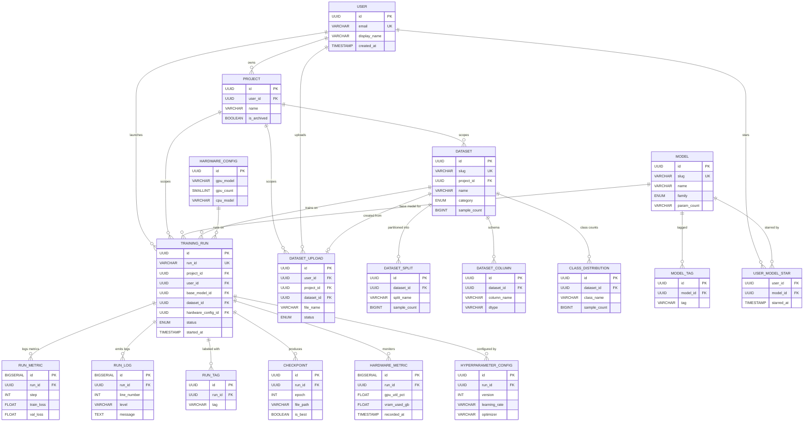

# Entity-Relationship Design — ML-Tools

> Derived from [data_dictionary.md](file:///c:/Users/PC/Desktop/ml-tools/docs/data_dictionary.md) (18 entities, 5 UI screens).

---

## 1 · Relationship Catalogue

Every relationship below maps directly to a user interaction on the frontend. The **cardinality notation** uses standard crow's-foot symbols:

| Symbol | Meaning |
|--------|---------|
| `\|\|` | Exactly one (mandatory) |
| `o\|` | Zero or one (optional) |
| `}o` | Zero or more (many side, optional) |
| `}\|` | One or more (many side, mandatory) |

---

### Core Ownership Chain

| # | Parent | Child | Cardinality | FK Location | UI Rationale |
|---|--------|-------|-------------|-------------|--------------|
| R1 | `user` | `project` | **1 → 0..\*** | `project.user_id` | A user owns zero-or-many projects. Every project has exactly one owner. |
| R2 | `project` | `training_run` | **1 → 0..\*** | `training_run.project_id` | Runs are scoped to a project (multi-project isolation). |
| R3 | `project` | `dataset` | **1 → 0..\*** | `dataset.project_id` | Datasets are scoped per project. |
| R4 | `user` | `training_run` | **1 → 0..\*** | `training_run.user_id` | Tracks *who launched* the run (audit trail). |

### Training Run Hub (star schema center)

| # | Parent | Child | Cardinality | FK Location | UI Rationale |
|---|--------|-------|-------------|-------------|--------------|
| R5 | `model` | `training_run` | **1 → 0..\*** | `training_run.base_model_id` | "Use as Base" button selects a model. A model can be base for many runs. FK is nullable when no base model is selected. |
| R6 | `dataset` | `training_run` | **1 → 0..\*** | `training_run.dataset_id` | Dataset selector in run config. Every run trains on exactly one dataset. |
| R7 | `training_run` | `run_metric` | **1 → 0..\*** | `run_metric.run_id` | Dashboard charts plot time-series metrics per run. Millions of rows. |
| R8 | `training_run` | `run_log` | **1 → 0..\*** | `run_log.run_id` | Dashboard terminal streams log lines per run. |
| R9 | `training_run` | `run_tag` | **1 → 0..\*** | `run_tag.run_id` | Tag badges under run name in Experiments table. |
| R10 | `training_run` | `checkpoint` | **1 → 0..\*** | `checkpoint.run_id` | "Download Checkpoint" action; checkpoints saved per epoch. |
| R11 | `training_run` | `hardware_metric` | **1 → 0..\*** | `hardware_metric.run_id` | Hardware Monitor gauges. FK nullable — system-level metrics exist when idle. |
| R12 | `training_run` | `hyperparameter_config` | **1 → 0..\*** | `hyperparameter_config.run_id` | Dashboard "Hyperparameters" panel; each "Apply" creates a new version row. |

### Dataset Decomposition

| # | Parent | Child | Cardinality | FK Location | UI Rationale |
|---|--------|-------|-------------|-------------|--------------|
| R13 | `dataset` | `dataset_split` | **1 → 0..\*** | `dataset_split.dataset_id` | Split badges: `train`, `val`, `test`. |
| R14 | `dataset` | `dataset_column` | **1 → 0..\*** | `dataset_column.dataset_id` | Schema tab: column metadata grid. |
| R15 | `dataset` | `class_distribution` | **1 → 0..\*** | `class_distribution.dataset_id` | Overview tab bar chart. |

### Model Metadata

| # | Parent | Child | Cardinality | FK Location | UI Rationale |
|---|--------|-------|-------------|-------------|--------------|
| R16 | `model` | `model_tag` | **1 → 0..\*** | `model_tag.model_id` | Tag chips on model cards. |

### Many-to-Many: User ↔ Model (Stars)

| # | Entity A | Entity B | Junction Table | Cardinality | UI Rationale |
|---|----------|----------|----------------|-------------|--------------|
| R17 | `user` | `model` | `user_model_star` | **M : N** | Star toggle on model cards. One user stars many models; one model is starred by many users. |

> **FK placement**: `user_model_star` holds composite PK `(user_id, model_id)` — both are FKs.

### Upload Pipeline

| # | Parent | Child | Cardinality | FK Location | UI Rationale |
|---|--------|-------|-------------|-------------|--------------|
| R18 | `user` | `dataset_upload` | **1 → 0..\*** | `dataset_upload.user_id` | Tracks uploader in Upload Hub. |
| R19 | `project` | `dataset_upload` | **1 → 0..\*** | `dataset_upload.project_id` | Scoped per project. |
| R20 | `dataset` | `dataset_upload` | **1 → 0..1** | `dataset_upload.dataset_id` | After validation, an upload is linked to exactly one dataset. FK nullable during upload/validation. |

### Hardware Config

| # | Parent | Child | Cardinality | FK Location | UI Rationale |
|---|--------|-------|-------------|-------------|--------------|
| R21 | `hardware_config` | `training_run` | **1 → 0..\*** | `training_run.hardware_config_id`* | Hardware Monitor header displays machine spec. Multiple runs share the same hardware. |

> \* *Implied FK — not yet in the data dictionary. Recommend adding `hardware_config_id UUID FK` to `training_run`.*

---

## 2 · Entity-Relationship Diagram (Mermaid)

---

## 3 · Foreign Key Placement Rules

> **Principle**: The FK always lives on the *child* side (many-side) of the relationship. For M:N, a junction table holds both FKs as a composite PK.

### FK Residency Summary

| FK Column | Resides In | References | Constraint | ON DELETE |
|-----------|-----------|------------|------------|-----------|
| `project.user_id` | `project` | `user.id` | NOT NULL | CASCADE — deleting user removes their projects |
| `training_run.project_id` | `training_run` | `project.id` | NOT NULL | CASCADE |
| `training_run.user_id` | `training_run` | `user.id` | NOT NULL | RESTRICT — don't delete users with active runs |
| `training_run.base_model_id` | `training_run` | `model.id` | NULLABLE | SET NULL — model removal doesn't break run history |
| `training_run.dataset_id` | `training_run` | `dataset.id` | NOT NULL | RESTRICT — can't delete dataset with linked runs |
| `training_run.hardware_config_id` | `training_run` | `hardware_config.id` | NULLABLE | SET NULL |
| `run_metric.run_id` | `run_metric` | `training_run.id` | NOT NULL | CASCADE |
| `run_log.run_id` | `run_log` | `training_run.id` | NOT NULL | CASCADE |
| `run_tag.run_id` | `run_tag` | `training_run.id` | NOT NULL | CASCADE |
| `checkpoint.run_id` | `checkpoint` | `training_run.id` | NOT NULL | CASCADE |
| `hardware_metric.run_id` | `hardware_metric` | `training_run.id` | NULLABLE | SET NULL — system-level metrics survive run deletion |
| `hyperparameter_config.run_id` | `hyperparameter_config` | `training_run.id` | NOT NULL | CASCADE |
| `dataset.project_id` | `dataset` | `project.id` | NOT NULL | CASCADE |
| `dataset_split.dataset_id` | `dataset_split` | `dataset.id` | NOT NULL | CASCADE |
| `dataset_column.dataset_id` | `dataset_column` | `dataset.id` | NOT NULL | CASCADE |
| `class_distribution.dataset_id` | `class_distribution` | `dataset.id` | NOT NULL | CASCADE |
| `model_tag.model_id` | `model_tag` | `model.id` | NOT NULL | CASCADE |
| `user_model_star.user_id` | `user_model_star` | `user.id` | NOT NULL (PK) | CASCADE |
| `user_model_star.model_id` | `user_model_star` | `model.id` | NOT NULL (PK) | CASCADE |
| `dataset_upload.user_id` | `dataset_upload` | `user.id` | NOT NULL | RESTRICT |
| `dataset_upload.project_id` | `dataset_upload` | `project.id` | NOT NULL | CASCADE |
| `dataset_upload.dataset_id` | `dataset_upload` | `dataset.id` | NULLABLE | SET NULL — linked after validation completes |

---

## 4 · Relationship Type Summary

| Type | Count | Relationships |
|------|-------|---------------|
| **One-to-Many (1:N)** | 19 | R1–R16, R18–R20 (most relationships) |
| **Many-to-Many (M:N)** | 1 | R17 — `user` ↔ `model` via `user_model_star` |
| **One-to-One (1:1)** | 0 | None — `dataset_upload → dataset` is technically 1:0..1 (nullable FK), grouped under 1:N |

> [!IMPORTANT]
> **Gap found**: The data dictionary doesn't have a `hardware_config_id` FK on `training_run`. Consider adding it to link runs to their machine spec (R21). Without it, the Hardware Monitor header string is orphaned from the relational model.

> [!TIP]
> The `training_run` table is the **star schema hub** — it holds 5 inbound FKs (`project_id`, `user_id`, `base_model_id`, `dataset_id`, `hardware_config_id`) and fans out to 6 child tables (`run_metric`, `run_log`, `run_tag`, `checkpoint`, `hardware_metric`, `hyperparameter_config`). This makes it the most connected entity and the natural query anchor.
