# ML-Tools — General Use Case Model

> Derived from: 5 frontend screens (`App.tsx`), 18 database entities (`schema.sql`), and 3 normalization docs.

---

## 1. Actor Identification

### 1.1 Primary Actors

| Actor | Role | Evidence |
|---|---|---|
| **Data Scientist / ML Engineer** | Authenticated human user who creates projects, uploads datasets, configures & launches training runs, browses the model library, monitors hardware, and manages experiments. | `user` table (auth, `password_hash`, `is_active`); every FK chain roots here via `project.user_id` / `training_run.user_id` / `dataset_upload.user_id`. |
| **Guest User (Read-Only)** | Unauthenticated viewer who can browse the public model library and view architecture details. Cannot create runs, upload data, or access project-scoped resources. | `model.is_public` flag; Model Library screen has no auth-gated actions beyond "Use as Base" / "Download". |

### 1.2 Secondary Actors (System / Supporting)

| Actor | Role | Evidence |
|---|---|---|
| **Training Engine** | Background process that executes training runs: emits metric time-series, log lines, checkpoints, and hardware telemetry. Updates run status (`running → completed / failed / stopped`). | `run_metric` (500K–5M rows/run), `run_log`, `hardware_metric`, `checkpoint` tables; real-time simulation loop in App.tsx. |
| **Upload Pipeline** | Backend process that receives file uploads, tracks upload progress, validates datasets, and transitions status (`uploading → validating → valid / error`). Links validated uploads to `dataset` records. | `dataset_upload` table with `status` enum, `upload_progress_pct`, `dataset_id` nullable FK; simulated upload in DatasetsView. |
| **Hardware Monitor** | System daemon that samples GPU, CPU, RAM, VRAM, disk I/O, and network metrics at regular intervals — including idle-system metrics when no run is active. | `hardware_metric` table with nullable `run_id` FK, `idx_hw_metric_idle` partial index; HardwareView gauges/heatmaps/area charts. |
| **Checkpoint Manager** | Background service that auto-saves model checkpoints at each epoch, marks the best checkpoint (`is_best`), and provides download paths. | `checkpoint` table with `is_best`, `file_path`, `val_acc`; partial index `idx_ckpt_best`. |

---

## 2. General Use Cases by Functional Module

### Module A — User Authentication & Authorization

| # | Use Case | Actors | DB Entities | Screen |
|---|---|---|---|---|
| A1 | Register Account | Data Scientist | `user` | (implied) |
| A2 | Log In / Log Out | Data Scientist | `user.last_login_at` | (implied) |
| A3 | Deactivate / Reactivate Account | Data Scientist | `user.is_active` | Settings |
| A4 | **Enforce User Authorization** | Training Engine, Upload Pipeline | `user.id` → every FK chain | (infrastructure) |

### Module B — Project Management & Multi-Project Isolation

| # | Use Case | Actors | DB Entities | Screen |
|---|---|---|---|---|
| B1 | Create Project | Data Scientist | `project` | (implied) |
| B2 | List / Switch Projects | Data Scientist | `project` | Sidebar / Settings |
| B3 | Archive / Unarchive Project | Data Scientist | `project.is_archived` | Settings |
| B4 | **Enforce Project-Level Isolation** | Training Engine, Upload Pipeline | `project.user_id`, cascading FKs | (infrastructure) |

> **IMPORTANT:**
> Every data entity (dataset, training run, upload) is scoped to a project via `project_id`, and every project is owned by a single user. This two-level ownership chain (`user → project → *`) is the backbone of multi-tenant isolation.

### Module C — Dataset Management

| # | Use Case | Actors | DB Entities | Screen |
|---|---|---|---|---|
| C1 | Browse Dataset Library | Data Scientist, Guest User | `dataset` | Datasets (left panel) |
| C2 | Search & Filter Datasets | Data Scientist | `dataset.category`, `name` | Datasets (search + category chips) |
| C3 | View Dataset Overview | Data Scientist | `dataset`, `class_distribution`, `dataset_split` | Datasets → Overview tab |
| C4 | View Dataset Schema | Data Scientist | `dataset_column` | Datasets → Schema tab |
| C5 | Preview Sample Rows | Data Scientist | (application-level) | Datasets → Samples tab |
| C6 | Export Dataset Metadata | Data Scientist | `dataset`, `dataset_column` | Datasets → Export button |

### Module D — Dataset Upload & Validation

| # | Use Case | Actors | DB Entities | Screen |
|---|---|---|---|---|
| D1 | Upload Dataset File(s) | Data Scientist | `dataset_upload` | Datasets → Upload Hub (drag & drop) |
| D2 | Track Upload Progress | Data Scientist, Upload Pipeline | `dataset_upload.upload_progress_pct` | Datasets → Upload Hub (progress bars) |
| D3 | Validate Uploaded Dataset | Upload Pipeline | `dataset_upload.status` | Datasets → Upload Hub (status badges) |
| D4 | Link Validated Upload to Dataset | Upload Pipeline | `dataset_upload.dataset_id` FK | (infrastructure) |
| D5 | Remove / Dismiss Upload Entry | Data Scientist | `dataset_upload` | Datasets → Upload Hub (✕ button) |
| D6 | Soft-Delete Dataset | Data Scientist | `dataset.is_deleted` | (implied) |

### Module E — Model Library / Registry

| # | Use Case | Actors | DB Entities | Screen |
|---|---|---|---|---|
| E1 | Browse Model Library | Data Scientist, Guest User | `model`, `model_tag` | Models (card grid) |
| E2 | Search & Filter Models | Data Scientist | `model.family`, `name` | Models (search + family chips) |
| E3 | Sort Models | Data Scientist | `model.forks`, `top1_acc`, `param_count` | Models (sort buttons) |
| E4 | View Architecture Detail | Data Scientist, Guest User | `model.description`, `architecture_svg` | Models → Arch Modal |
| E5 | Star / Unstar Model | Data Scientist | `user_model_star` | Models (star toggle) |
| E6 | Select Model as Base for Run | Data Scientist | `training_run.base_model_id` | Models → "Use as Base" button |
| E7 | Download Model Weights | Data Scientist | `model.download_url`, `weight_path` | Models → Download button (modal) |

### Module F — Experiment Tracking

| # | Use Case | Actors | DB Entities | Screen |
|---|---|---|---|---|
| F1 | List Training Runs | Data Scientist | `v_experiment_list` view | Experiments (table) |
| F2 | Search & Filter Runs | Data Scientist | `training_run`, `run_tag` | Experiments (search + filter panel) |
| F3 | Sort Runs by Metric | Data Scientist | `training_run.best_val_acc`, `training_time_sec` | Experiments (sortable columns) |
| F4 | Select Runs for Comparison | Data Scientist | (application-level) | Experiments (checkbox + "Compare N") |
| F5 | Expand Run Detail (Inline) | Data Scientist | `training_run`, `hyperparameter_config` | Experiments (expanded row) |
| F6 | Export Experiment Table | Data Scientist | `v_experiment_list` | Experiments → Export button |
| F7 | Tag a Training Run | Data Scientist | `run_tag` | Experiments (tag badges) |
| F8 | Soft-Delete Training Run | Data Scientist | `training_run.is_deleted` | (implied) |
| F9 | Clone Run / Load Config | Data Scientist | `training_run.config_json` | (implied via `config_json`) |

### Module G — Training Run Execution (Dashboard)

| # | Use Case | Actors | DB Entities | Screen |
|---|---|---|---|---|
| G1 | Monitor Live Training Metrics | Data Scientist, Training Engine | `run_metric` | Dashboard (loss/accuracy charts) |
| G2 | Toggle Loss / Accuracy View | Data Scientist | `run_metric` | Dashboard (tab switch) |
| G3 | Pause / Resume Training Run | Data Scientist, Training Engine | `training_run.status` | Top bar (Pause / Resume) |
| G4 | Stop Training Run | Data Scientist, Training Engine | `training_run.status` | Top bar (Stop) |
| G5 | View Live Training Log | Data Scientist, Training Engine | `run_log` | Dashboard (terminal panel) |
| G6 | Edit Hyperparameters (Mid-Run) | Data Scientist | `hyperparameter_config` (versioned) | Dashboard (sidebar form + Apply) |
| G7 | View Recent Runs Summary | Data Scientist | `training_run` | Dashboard (bottom table) |
| G8 | View Mini Hardware Gauges | Data Scientist, Hardware Monitor | `hardware_metric` | Dashboard (right column) |

### Module H — Hardware Monitoring

| # | Use Case | Actors | DB Entities | Screen |
|---|---|---|---|---|
| H1 | View GPU Utilization Gauges | Data Scientist, Hardware Monitor | `hardware_metric.gpu_util_pct` | Hardware (circular gauges) |
| H2 | View GPU Temperature Heatmap | Data Scientist, Hardware Monitor | `hardware_metric.gpu_temp_c` | Hardware (SM heatmap grid) |
| H3 | View GPU / CPU / VRAM / RAM Trends | Data Scientist, Hardware Monitor | `hardware_metric` (all cols) | Hardware (area charts) |
| H4 | View Disk I/O Throughput | Data Scientist, Hardware Monitor | `hardware_metric.disk_read/write_gbps` | Hardware (disk chart) |
| H5 | View Network I/O Throughput | Data Scientist, Hardware Monitor | `hardware_metric.net_rx/tx_gbps` | Hardware (network chart) |
| H6 | View Per-GPU VRAM Detail | Data Scientist, Hardware Monitor | `hardware_metric.vram_used/total_gb` | Hardware (memory detail panel) |
| H7 | Scrub Epoch Timeline (Historical) | Data Scientist | `hardware_metric.epoch` | Hardware (epoch slider) |
| H8 | Browse Hardware Configs | Data Scientist | `hardware_config` | Hardware (header: GPU model, count, CPU, RAM) |

### Module I — Checkpoint Management

| # | Use Case | Actors | DB Entities | Screen |
|---|---|---|---|---|
| I1 | Auto-Save Checkpoint per Epoch | Training Engine, Checkpoint Manager | `checkpoint` | (background) |
| I2 | Mark Best Checkpoint | Checkpoint Manager | `checkpoint.is_best` | (background) |
| I3 | Download Checkpoint | Data Scientist | `checkpoint.file_path`, `training_run.checkpoint_path` | Dashboard / Experiments (implied) |

---

## 3. Use Case Diagram

```mermaid
graph LR
    %% ── Actors ──
    DS["👤 Data Scientist /<br>ML Engineer"]
    GU["👁 Guest User"]
    TE["⚙ Training Engine"]
    UP["📤 Upload Pipeline"]
    HM["📊 Hardware Monitor"]
    CM["💾 Checkpoint Manager"]

    %% ── Module A: Auth ──
    subgraph A["🔐 Authentication & Authorization"]
        A1["A1 · Register Account"]
        A2["A2 · Log In / Log Out"]
        A3["A3 · Deactivate Account"]
        A4["A4 · Enforce User Authorization"]
    end

    %% ── Module B: Projects ──
    subgraph B["📁 Project Management"]
        B1["B1 · Create Project"]
        B2["B2 · List / Switch Projects"]
        B3["B3 · Archive Project"]
        B4["B4 · Enforce Project Isolation"]
    end

    %% ── Module C: Datasets ──
    subgraph C["🗂 Dataset Management"]
        C1["C1 · Browse Dataset Library"]
        C2["C2 · Search & Filter Datasets"]
        C3["C3 · View Dataset Overview"]
        C4["C4 · View Dataset Schema"]
        C5["C5 · Preview Sample Rows"]
        C6["C6 · Export Dataset Metadata"]
    end

    %% ── Module D: Upload ──
    subgraph D["☁ Dataset Upload & Validation"]
        D1["D1 · Upload Dataset Files"]
        D2["D2 · Track Upload Progress"]
        D3["D3 · Validate Uploaded Dataset"]
        D4["D4 · Link Upload to Dataset"]
        D5["D5 · Remove Upload Entry"]
        D6["D6 · Soft-Delete Dataset"]
    end

    %% ── Module E: Models ──
    subgraph E["🧠 Model Library"]
        E1["E1 · Browse Model Library"]
        E2["E2 · Search & Filter Models"]
        E3["E3 · Sort Models"]
        E4["E4 · View Architecture Detail"]
        E5["E5 · Star / Unstar Model"]
        E6["E6 · Select as Base for Run"]
        E7["E7 · Download Model Weights"]
    end

    %% ── Module F: Experiments ──
    subgraph F["🧪 Experiment Tracking"]
        F1["F1 · List Training Runs"]
        F2["F2 · Search & Filter Runs"]
        F3["F3 · Sort Runs by Metric"]
        F4["F4 · Compare Selected Runs"]
        F5["F5 · Expand Run Detail"]
        F6["F6 · Export Experiment Table"]
        F7["F7 · Tag a Training Run"]
        F8["F8 · Soft-Delete Run"]
        F9["F9 · Clone Run / Load Config"]
    end

    %% ── Module G: Dashboard ──
    subgraph G["📈 Training Dashboard"]
        G1["G1 · Monitor Live Metrics"]
        G2["G2 · Toggle Loss / Accuracy"]
        G3["G3 · Pause / Resume Run"]
        G4["G4 · Stop Run"]
        G5["G5 · View Training Log"]
        G6["G6 · Edit Hyperparams Mid-Run"]
        G7["G7 · View Recent Runs"]
        G8["G8 · View Mini HW Gauges"]
    end

    %% ── Module H: Hardware ──
    subgraph H["🖥 Hardware Monitoring"]
        H1["H1 · View GPU Gauges"]
        H2["H2 · View Temp Heatmap"]
        H3["H3 · View Utilization Trends"]
        H4["H4 · View Disk I/O"]
        H5["H5 · View Network I/O"]
        H6["H6 · View VRAM Detail"]
        H7["H7 · Scrub Epoch Timeline"]
        H8["H8 · Browse HW Configs"]
    end

    %% ── Module I: Checkpoints ──
    subgraph I["💾 Checkpoint Management"]
        I1["I1 · Auto-Save Checkpoint"]
        I2["I2 · Mark Best Checkpoint"]
        I3["I3 · Download Checkpoint"]
    end

    %% ── Actor → Use Case Links ──

    %% Data Scientist: full access
    DS --- A1 & A2 & A3
    DS --- B1 & B2 & B3
    DS --- C1 & C2 & C3 & C4 & C5 & C6
    DS --- D1 & D2 & D5 & D6
    DS --- E1 & E2 & E3 & E4 & E5 & E6 & E7
    DS --- F1 & F2 & F3 & F4 & F5 & F6 & F7 & F8 & F9
    DS --- G1 & G2 & G3 & G4 & G5 & G6 & G7 & G8
    DS --- H1 & H2 & H3 & H4 & H5 & H6 & H7 & H8
    DS --- I3

    %% Guest User: read-only model library + dataset browse
    GU --- C1
    GU --- E1 & E4

    %% Training Engine
    TE --- A4
    TE --- G1 & G3 & G4 & G5

    %% Upload Pipeline
    UP --- A4
    UP --- B4
    UP --- D2 & D3 & D4

    %% Hardware Monitor
    HM --- G8
    HM --- H1 & H2 & H3 & H4 & H5 & H6

    %% Checkpoint Manager
    CM --- I1 & I2
```

---

## 4. Cross-Cutting Infrastructure Use Cases

These don't belong to a single screen but underpin the entire system:

| Use Case | Purpose | Mechanism |
|---|---|---|
| **Enforce User Authorization (A4)** | Every write operation verifies the authenticated `user.id` before creating/modifying project-scoped resources. | `user_id` FK on `project`, `training_run`, `dataset_upload`. |
| **Enforce Project-Level Isolation (B4)** | Datasets, runs, and uploads are strictly scoped to a `project_id`. No cross-project data leakage. | `project_id` FK on `dataset`, `training_run`, `dataset_upload` with `ON DELETE CASCADE`. |
| **Soft-Delete & Audit Trail** | Datasets and runs use `is_deleted` flags instead of hard deletes. All entities carry `created_at` / `updated_at` audit timestamps. | `dataset.is_deleted`, `training_run.is_deleted`, `user.created_at`, etc. |
| **Denormalized Materialized Aggregates** | `training_run` carries `best_val_acc`, `train_loss` etc. as deliberate denorm to avoid scanning millions of `run_metric` rows on the Experiments list page. | `ponytail:` comment in schema.sql L240. |

---

## 5. Summary Statistics

| Dimension | Count |
|---|---|
| **Primary Actors** | 2 |
| **Secondary (System) Actors** | 4 |
| **Functional Modules** | 9 (A–I) |
| **Total General Use Cases** | **46** |
| **DB Entities Referenced** | 18 tables + 2 views |
| **Frontend Screens Mapped** | 5 (Dashboard, Experiments, Models, Hardware, Datasets) + implied (Settings, Terminal) |
