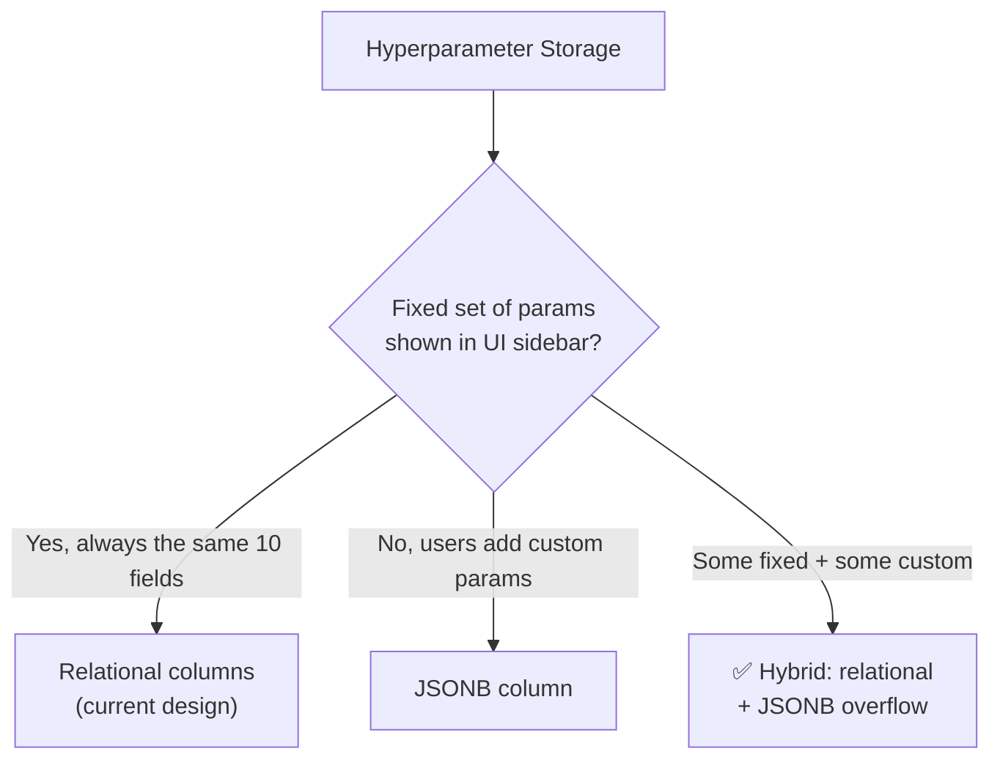
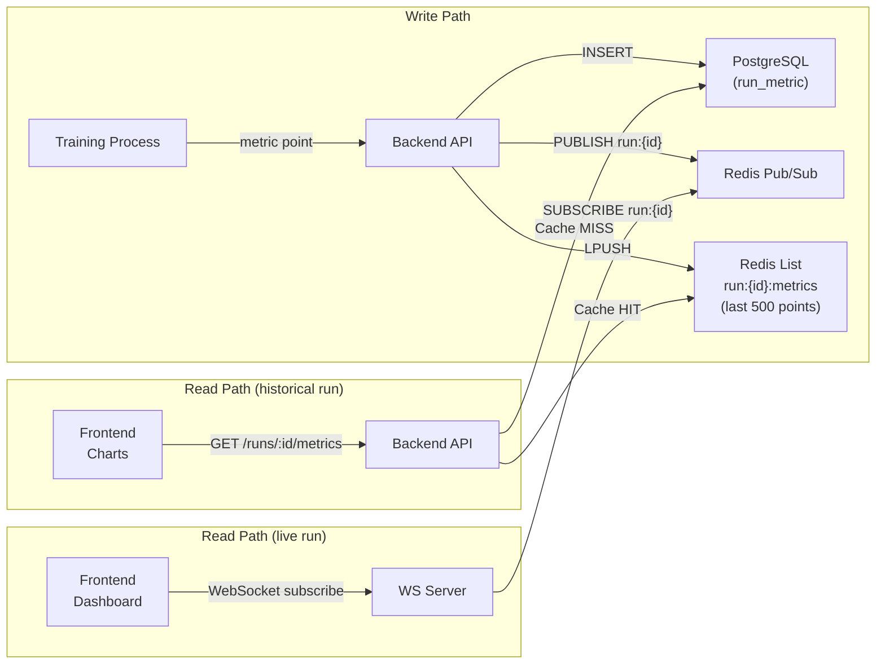

# Database Normalization & Performance Tuning — ML-Tools

> Source: [data_dictionary.md](file:///c:/Users/PC/Desktop/ml-tools/docs/data_dictionary.md) · [erd_relationships.md](file:///C:/Users/PC/.gemini/antigravity-ide/brain/de5a2aa4-4ef7-4123-b700-59812d8bb7e6/erd_relationships.md)

---

## 1 · Normalization Audit (up to 3NF)

### Quick 3NF Checklist

| Normal Form | Rule | In plain English |
|-------------|------|------------------|
| **1NF** | Atomic values, no repeating groups | Every cell holds one value; no arrays in columns |
| **2NF** | No partial dependencies on composite PK | Every non-key column depends on the *whole* PK |
| **3NF** | No transitive dependencies | Non-key columns depend *only* on the PK, not on other non-key columns |

---

### Table-by-Table Findings

#### ✅ Tables Already in 3NF (no changes needed)

| Table | Notes |
|-------|-------|
| `user` | Flat, all columns depend only on `id` |
| `project` | Single FK (`user_id`), no transitive deps |
| `run_tag` | Simple junction-like table, unique on `(run_id, tag)` |
| `run_log` | Append-only log, all columns depend on `id` |
| `checkpoint` | All columns depend on `id` |
| `dataset_split` | Child of dataset, clean |
| `dataset_column` | Child of dataset, clean |
| `class_distribution` | Child of dataset, clean |
| `dataset_upload` | Clean after FK corrections |
| `model_tag` | Simple tag junction |
| `user_model_star` | Composite PK `(user_id, model_id)`, no non-key columns except `starred_at` |
| `hardware_config` | Flat reference table |

---

#### ⚠️ Violations Found

##### V1 · `training_run` — Transitive dependency via `dataset_name`

**Problem**: Column `dataset_name VARCHAR(60)` (line 181) duplicates `dataset.name`. It's transitively dependent on `dataset_id` → `dataset.name`, violating 3NF.

**Fix**: Drop `dataset_name`. The frontend API should JOIN or include `dataset.name` via the `dataset_id` FK.

```diff
  -- training_run
- dataset_name   VARCHAR(60)  NOT NULL,   -- ❌ 3NF violation: derivable from dataset_id
  dataset_id     UUID         NOT NULL REFERENCES dataset(id),
```

> The UI column "Dataset" is populated by `JOIN dataset ON training_run.dataset_id = dataset.id`.

---

##### V2 · `training_run` — Transitive dependency via `gpu_model`

**Problem**: `gpu_model VARCHAR(40)` (line 192) duplicates `hardware_config.gpu_model`. Transitively dependent on `hardware_config_id`.

**Fix**: Drop `gpu_model` from `training_run`. Resolve via FK join.

```diff
  -- training_run
- gpu_model      VARCHAR(40),            -- ❌ 3NF violation: derivable from hardware_config_id
  hardware_config_id UUID REFERENCES hardware_config(id),
```

---

##### V3 · `training_run` — Transitive dependency via `model_type`

**Problem**: `model_type VARCHAR(60)` (line 180) stores the architecture name, which is already available as `model.name` or `model.family` via `base_model_id`.

**Fix**: Drop `model_type`. Resolve via FK join on `base_model_id`.

```diff
  -- training_run
- model_type     VARCHAR(60)  NOT NULL,   -- ❌ derivable from base_model_id → model
  base_model_id  UUID         REFERENCES model(id),
```

> [!WARNING]
> **Edge case**: If `base_model_id` is nullable (runs without a base model), you still need to know what architecture ran. Two options:
> 1. **Make `base_model_id` NOT NULL** — require a model registry entry for every architecture (recommended).
> 2. **Keep `model_type` as a deliberate denormalization** — annotate it as a snapshot field. See Section 2.

---

##### V4 · `training_run` — Redundant hyperparameter columns

**Problem**: `optimizer`, `learning_rate`, `batch_size` appear on both `training_run` (lines 182–184) and `hyperparameter_config` (lines 469–471). This is a redundant copy violating 3NF — the source of truth is the versioned `hyperparameter_config` table.

**Fix**: Drop the flat columns from `training_run`. The Experiments table API query joins the *latest version* of `hyperparameter_config`.

```diff
  -- training_run
- optimizer      VARCHAR(20)  NOT NULL,   -- ❌ redundant with hyperparameter_config
- learning_rate  FLOAT        NOT NULL,   -- ❌ redundant
- batch_size     INT          NOT NULL,   -- ❌ redundant
  ...
```

```sql
-- API query: get latest hyperparams for a run
SELECT h.*
FROM   hyperparameter_config h
WHERE  h.run_id = $1
ORDER  BY h.version DESC
LIMIT  1;
```

> [!IMPORTANT]  
> **Decision point**: This is also a candidate for deliberate denormalization — see Section 2 below.

---

##### V5 · `training_run` — Redundant summary metrics

**Problem**: `best_val_acc`, `best_val_loss`, `train_acc`, `train_loss` (lines 187–190) are derivable from `run_metric` by aggregation (`MAX`, last-step value).

**Verdict**: **Keep as deliberate denormalization**. These are materialized aggregates needed by the Experiments table (listing page) and Dashboard stat badges. Computing them on-the-fly from millions of `run_metric` rows per page load is not viable.

```sql
-- ponytail: deliberate denorm — avoids full-table scan of run_metric on every Experiments list load.
-- Refresh via trigger or application-level write-through on each run_metric INSERT.
best_val_acc   FLOAT,
best_val_loss  FLOAT,
train_acc      FLOAT,
train_loss     FLOAT,
```

---

##### V6 · `model` — VARCHAR for numeric fields

**Problem**: `param_count`, `flops`, `top1_acc` are stored as `VARCHAR` (lines 306–308) instead of numeric types. This prevents sorting/filtering in the Model Library grid ("sort by params").

**Fix**: Use proper numeric types + a display-format helper in the API layer.

```diff
  -- model
- param_count  VARCHAR(20),    -- '350M'
- flops        VARCHAR(20),    -- '4.2B'
- top1_acc     VARCHAR(10),    -- '83.0%'
+ param_count  BIGINT,         -- 350000000 (raw count)
+ flops        BIGINT,         -- 4200000000
+ top1_acc     FLOAT,          -- 0.830
```

> The API formats these for display: `350M`, `4.2B`, `83.0%`.

---

### 3NF Audit Summary

| # | Table | Column(s) | Violation | Action |
|---|-------|-----------|-----------|--------|
| V1 | `training_run` | `dataset_name` | Transitive dep via `dataset_id` | **Drop** — join at query time |
| V2 | `training_run` | `gpu_model` | Transitive dep via `hardware_config_id` | **Drop** — join at query time |
| V3 | `training_run` | `model_type` | Transitive dep via `base_model_id` | **Drop** (or keep as snapshot — see V3 warning) |
| V4 | `training_run` | `optimizer`, `learning_rate`, `batch_size` | Redundant with `hyperparameter_config` | **Drop** — join latest version |
| V5 | `training_run` | `best_val_acc/loss`, `train_acc/loss` | Derivable from `run_metric` | **Keep** — deliberate denorm for list-page speed |
| V6 | `model` | `param_count`, `flops`, `top1_acc` | VARCHAR masking numeric data | **Change type** to BIGINT/FLOAT |

---

## 2 · Hybrid Storage: JSONB vs Relational

### The Two Candidates

Your schema has two entities where this question is most impactful:

| Entity | Current Design | Core Question |
|--------|---------------|---------------|
| `hyperparameter_config` | 12 typed relational columns + `version` | Fixed schema or fluid key-value? |
| `run_metric` | 4 fixed metric columns | Fixed set or extensible? |

---

### Decision Matrix: `hyperparameter_config`



#### Recommendation: **Hybrid** — relational core + JSONB overflow

The Dashboard sidebar always renders the same 10 fields (learning_rate, batch_size, optimizer, scheduler, momentum, weight_decay, dropout, epochs, warmup_steps, grad_clip). But ML practitioners often add custom params (label_smoothing, mixup_alpha, gradient_accumulation_steps, etc.).

**Proposed schema**:

```sql
CREATE TABLE hyperparameter_config (
    id             UUID PRIMARY KEY DEFAULT gen_random_uuid(),
    run_id         UUID NOT NULL REFERENCES training_run(id) ON DELETE CASCADE,
    version        INT  NOT NULL DEFAULT 1,

    -- ── Fixed fields (rendered by UI sidebar) ──
    learning_rate  VARCHAR(20)  NOT NULL,
    batch_size     VARCHAR(10)  NOT NULL,
    optimizer      VARCHAR(20)  NOT NULL,
    scheduler      VARCHAR(40),
    momentum       VARCHAR(10),
    weight_decay   VARCHAR(20),
    dropout        VARCHAR(10),
    epochs         VARCHAR(10)  NOT NULL,
    warmup_steps   VARCHAR(10),
    grad_clip      VARCHAR(10),

    -- ── Overflow (custom / experimental params) ──
    extra          JSONB NOT NULL DEFAULT '{}',

    -- ── Audit ──
    applied_at     TIMESTAMPTZ NOT NULL DEFAULT now(),

    UNIQUE (run_id, version)
);

-- GIN index for querying inside extra
CREATE INDEX idx_hpconfig_extra ON hyperparameter_config USING gin (extra);
```

#### Pros/Cons Comparison

| Criteria | Pure Relational | Pure JSONB | **Hybrid** (recommended) |
|----------|----------------|------------|--------------------------|
| **Type safety** | ✅ DB-enforced | ❌ App-enforced | ✅ Fixed fields typed, overflow flexible |
| **UI sidebar binding** | ✅ 1:1 column→field | ⚠️ Must extract keys | ✅ Direct column mapping for known fields |
| **Schema evolution** | ❌ ALTER TABLE per new param | ✅ Zero migration | ✅ Only ALTER for *promoted* params |
| **Filtering/sorting** | ✅ Native WHERE/ORDER BY | ⚠️ `extra->>'key'` with cast | ✅ Best of both |
| **Version history** | ✅ Row-per-version | ✅ Row-per-version | ✅ Same |
| **API serialization** | ⚠️ Fixed response shape | ✅ Dynamic | ✅ Spread fixed + extra into flat JSON |
| **Storage efficiency** | ✅ Compact | ⚠️ Key names repeated per row | ✅ Good |

**Frontend API integration pattern** (REST):

```jsonc
// GET /api/runs/:id/hyperparams?version=latest
{
  "version": 3,
  "learning_rate": "5e-4",
  "batch_size": "32",
  "optimizer": "AdamW",
  "scheduler": "OneCycleLR",
  // ... other fixed fields ...
  "label_smoothing": "0.1",        // ← from extra JSONB
  "mixup_alpha": "0.2",            // ← from extra JSONB
  "applied_at": "2026-07-17T10:15:00Z"
}
```

The API layer merges relational columns + `extra` keys into a flat object. The UI sidebar renders known keys with typed inputs; unknown keys render as plain text fields.

---

### Decision Matrix: `run_metric`

| Criteria | Current (4 fixed columns) | JSONB `metrics` column | **Verdict** |
|----------|--------------------------|------------------------|-------------|
| **Query speed** | ✅ Columnar scans, trivial indexes | ❌ Extracting from JSONB on millions of rows is slow | **Keep relational** |
| **Chart rendering** | ✅ `SELECT step, train_loss FROM run_metric WHERE run_id = $1` — simple, fast | ❌ `SELECT step, (metrics->>'train_loss')::float` — extra cast per row | **Keep relational** |
| **Extensibility** | ⚠️ Need ALTER TABLE for new metrics | ✅ Add any key | Not needed — metrics are fixed by training loop |
| **Time-series engines** | ✅ TimescaleDB works on typed columns | ⚠️ Poor support | **Keep relational** |

> [!TIP]
> **Verdict**: Keep `run_metric` as **pure relational**. The 4 metrics (train_loss, val_loss, train_acc, val_acc) are fixed by the training loop UI. Chart rendering queries millions of rows — JSONB extraction would add ~3–5× overhead. If you ever need custom metrics, add a *separate* `run_custom_metric (run_id, step, metric_name, value)` EAV table rather than polluting the hot path.

---

### Decision Matrix: `training_run.config_json`

The data dictionary already has a `config_json JSONB` column on `training_run` (line 210). Clarification on its role:

| Column | Purpose | Relationship to `hyperparameter_config` |
|--------|---------|----------------------------------------|
| `config_json` | **Immutable snapshot** — frozen at run start for "Load Config" / "Clone Run" actions | Read-only archive |
| `hyperparameter_config` | **Versioned live config** — mutated via "Apply" button during training | Editable source of truth |

**Keep both.** They serve different UI actions and have different write patterns.

---

## 3 · Partitioning & Caching Strategy for High-Volume Tables

### The Problem

Three tables will reach **millions of rows** and are read on every page load:

| Table | Est. Rows/Run | Access Pattern | UI Component |
|-------|---------------|----------------|--------------|
| `run_metric` | 500K–5M | Time-series range scan by `run_id` + `step` | Dashboard loss/accuracy charts |
| `run_log` | 100K–1M | Append + tail scan by `run_id` | Dashboard terminal |
| `hardware_metric` | 100K–1M | Time-series range scan by `run_id` + `recorded_at` | Hardware Monitor gauges |

**Risk**: Unbounded table growth causes index bloat, VACUUM pressure, and lock contention that slows writes to `training_run` (which shares no physical pages but contends on shared buffer pool and WAL).

---

### Strategy A: PostgreSQL Native Partitioning

#### Partition by `run_id` (HASH, 32 buckets)

```sql
-- ── run_metric: partitioned by run_id hash ──
CREATE TABLE run_metric (
    id           BIGINT GENERATED ALWAYS AS IDENTITY,
    run_id       UUID        NOT NULL,
    step         INT         NOT NULL,
    train_loss   FLOAT       NOT NULL,
    val_loss     FLOAT,
    train_acc    FLOAT       NOT NULL,
    val_acc      FLOAT,
    recorded_at  TIMESTAMPTZ NOT NULL DEFAULT now(),
    PRIMARY KEY (id, run_id)    -- run_id must be in PK for partition routing
) PARTITION BY HASH (run_id);

-- Create 32 partitions (auto-balanced)
DO $$
BEGIN
  FOR i IN 0..31 LOOP
    EXECUTE format(
      'CREATE TABLE run_metric_p%s PARTITION OF run_metric
       FOR VALUES WITH (MODULUS 32, REMAINDER %s)',
      i, i
    );
  END LOOP;
END $$;
```

> [!NOTE]
> **Why HASH over RANGE?** `run_id` is a UUID — there's no natural range ordering. HASH distributes evenly and ensures a query filtered by `run_id` only touches 1 of 32 partitions (partition pruning).

#### Apply the same pattern to `run_log` and `hardware_metric`:

```sql
CREATE TABLE run_log ( ... ) PARTITION BY HASH (run_id);
CREATE TABLE hardware_metric ( ... ) PARTITION BY HASH (run_id);
```

---

### Strategy B: Indexing for Chart Queries

Each chart query follows the pattern:

```sql
-- Dashboard loss chart: all points for one run
SELECT step, train_loss, val_loss
FROM   run_metric
WHERE  run_id = $1
ORDER  BY step;
```

#### Recommended Indexes

```sql
-- Covering index: serves the chart query from index-only scan
CREATE INDEX idx_run_metric_chart
    ON run_metric (run_id, step)
    INCLUDE (train_loss, val_loss, train_acc, val_acc);

-- BRIN index on recorded_at for time-range queries (Hardware Monitor timeline slider)
CREATE INDEX idx_hw_metric_time
    ON hardware_metric USING brin (recorded_at)
    WITH (pages_per_range = 32);

-- run_log: tail query (latest N lines)
CREATE INDEX idx_run_log_tail
    ON run_log (run_id, line_number DESC);
```

> [!TIP]
> The covering index on `run_metric` means the chart query **never touches the heap** — it reads the B-tree only. This is the single biggest performance win for chart rendering.

---

### Strategy C: Materialized View for Sparklines

The Experiments table shows a **sparkline** (tiny chart) per run. This requires the latest ~50 metric points per run, but the table lists dozens of runs. Hitting `run_metric` for each row is expensive.

```sql
-- Materialized view: last 50 metric points per run (for sparklines)
CREATE MATERIALIZED VIEW mv_run_sparkline AS
SELECT run_id, step, train_loss, val_loss, train_acc, val_acc
FROM (
    SELECT *,
           ROW_NUMBER() OVER (PARTITION BY run_id ORDER BY step DESC) AS rn
    FROM   run_metric
) sub
WHERE rn <= 50
WITH NO DATA;

-- Refresh after each training epoch completes
REFRESH MATERIALIZED VIEW CONCURRENTLY mv_run_sparkline;

CREATE UNIQUE INDEX idx_mv_sparkline_pk ON mv_run_sparkline (run_id, step);
```

**API query for Experiments list**:

```sql
SELECT r.*, s.step, s.train_loss
FROM   training_run r
LEFT   JOIN mv_run_sparkline s ON s.run_id = r.id
WHERE  r.project_id = $1 AND r.is_deleted = false
ORDER  BY r.started_at DESC;
```

---

### Strategy D: Caching Layer (Redis)

For **live/running** training runs, the Dashboard polls for new metric points every 1–2 seconds. This hot-path should not hit PostgreSQL repeatedly.



#### Redis Key Design

| Key Pattern | Type | TTL | Purpose |
|-------------|------|-----|---------|
| `run:{id}:metrics` | List (capped at 500) | 1 hour after run completes | Recent metric points for live chart |
| `run:{id}:logs:tail` | List (capped at 200) | 1 hour after run completes | Terminal tail for live log view |
| `run:{id}:hw` | Hash | 30 seconds | Latest hardware snapshot for gauges |
| `run:{id}:status` | String | 5 minutes | Cached run status to avoid PG round-trip |

#### Write-Through Pattern

```
1. Training process emits metric → Backend API
2. API does THREE things in parallel:
   a. INSERT INTO run_metric (persistent store)
   b. LPUSH + LTRIM to Redis list (bounded buffer)
   c. PUBLISH to Redis channel (real-time push to WebSocket subscribers)
3. Frontend receives via WebSocket → appends to chart
```

**Result**: Live chart rendering has **zero PostgreSQL reads**. Historical chart loads hit PG once, then cache.

---

### Strategy E: Connection-Level Isolation

Prevent chart queries from contending with metric writes:

```
┌─────────────────────────────────────────────────────┐
│ PostgreSQL                                          │
│                                                     │
│  Primary (read-write)        Replica (read-only)    │
│  ┌─────────────────────┐     ┌────────────────────┐ │
│  │ training_run  INSERT │     │ run_metric  SELECT │ │
│  │ run_metric    INSERT │────▶│ run_log     SELECT │ │
│  │ checkpoint    INSERT │     │ hw_metric   SELECT │ │
│  └─────────────────────┘     └────────────────────┘ │
│        ▲                            ▲               │
│     Writes                    Chart queries         │
└─────────────────────────────────────────────────────┘
```

- **Primary connection pool**: training_run writes, metric inserts, checkpoint saves
- **Replica connection pool**: all chart/sparkline/terminal reads, Experiments list queries

> [!TIP]
> This can be done at the ORM level (e.g., Django `DATABASE_ROUTERS`, SQLAlchemy `binds`) without application code changes.

---

## Summary of Recommendations

| Area | Action | Impact |
|------|--------|--------|
| **3NF Cleanup** | Drop 5 redundant columns from `training_run` (V1–V4) | Eliminates update anomalies, reduces row width |
| **3NF Deliberate Denorm** | Keep `best_val_acc/loss`, `train_acc/loss` on `training_run` (V5) | Avoids million-row aggregation on list page |
| **Model types** | Change `param_count`/`flops`/`top1_acc` to numeric (V6) | Enables sorting/filtering in UI |
| **Hyperparams** | Hybrid: relational core + `extra JSONB` overflow | Type safety for UI fields + extensibility for custom params |
| **Metrics** | Keep pure relational (no JSONB) | Chart query speed on millions of rows |
| **Partitioning** | HASH(run_id) × 32 on `run_metric`, `run_log`, `hardware_metric` | Partition pruning: queries touch 1/32 of data |
| **Indexing** | Covering index on `(run_id, step) INCLUDE (metrics)` | Index-only scans for chart rendering |
| **Sparklines** | Materialized view `mv_run_sparkline` | Pre-computed last-50 points per run |
| **Live charts** | Redis pub/sub + capped lists | Zero PG reads for live dashboard |
| **Isolation** | Read replica for all chart/list queries | Write path never contends with read path |
