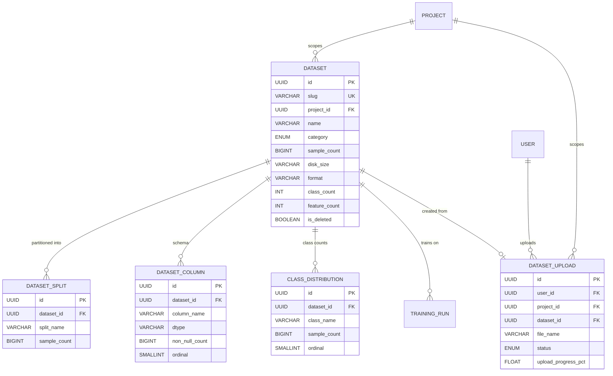

# Use Case Specification: Manage Dataset

| Field | Value |
|---|---|
| **UC ID** | UC-MD-001 |
| **Version** | 1.0 |
| **Date** | 2026-07-19 |
| **Status** | Draft |
| **Source** | [general_use_case_model.md](file:///c:/Users/PC/Desktop/ml-tools/docs/general_use_case_model.md) — Modules C & D |

---

## 1. Use Case Name & ID

| | |
|---|---|
| **ID** | UC-MD-001 |
| **Name** | Manage Dataset |
| **Package** | Dataset Management & Upload (Datasets screen) |
| **Priority** | High — datasets are required inputs for every training run |

---

## 2. Actors

### 2.1 Primary Actor

| Actor | Role |
|---|---|
| **Data Scientist / ML Engineer** | Authenticated user who browses, inspects, uploads, exports, and deletes datasets through the Datasets screen. |

### 2.2 Secondary Actors (System)

| Actor | Role | Triggered By |
|---|---|---|
| **Upload Pipeline** | Background process that receives file uploads, tracks progress, validates dataset files, extracts schema/metadata, and links validated uploads to `dataset` records. | Data Scientist — initiates upload via drag-drop or file picker |
| **Guest User** | Unauthenticated viewer who can browse the dataset library (left panel) in read-only mode. Cannot upload, export, or delete. | — |

---

## 3. Description

The Data Scientist manages the full lifecycle of datasets within a project: browsing and searching existing datasets, inspecting their structure via Overview/Schema/Samples tabs, uploading new dataset files via drag-and-drop or a file picker, monitoring upload and validation progress, exporting metadata, and soft-deleting datasets no longer needed. The Upload Pipeline handles background processing — tracking upload progress, validating file contents, extracting column schemas and class distributions, detecting dataset splits, and linking successful uploads to `dataset` records.

**Primary Screen:** Datasets (three-panel layout: left panel = dataset list, center panel = dataset detail with tabs, right panel = Upload Hub)

**Key DB Entities:** `dataset` (registry), `dataset_upload` (upload pipeline), `dataset_column` (schema), `class_distribution` (overview chart), `dataset_split` (train/val/test partitions)

---

## 4. Pre-conditions

Every pre-condition must be true **before** the Basic Flow begins. The system validates each and rejects with a descriptive error if any fails.

| # | Pre-condition | Validation |
|---|---|---|
| **PRE-1** | User is authenticated and active. | `SELECT 1 FROM user WHERE id = ? AND is_active = 1` returns a row. |
| **PRE-2** | An active project is selected. | `SELECT 1 FROM project WHERE id = ? AND user_id = ? AND is_archived = 0` returns a row. |
| **PRE-3** | At least one dataset exists in the project (for browse/view flows). | `SELECT COUNT(*) FROM dataset WHERE project_id = ? AND is_deleted = 0` > 0. |

> [!NOTE]
> PRE-3 is required only for UC-MD-002 through UC-MD-004 and UC-MD-007/008. UC-MD-005 (Upload) and UC-MD-006 (Handle Validation Error) do not require existing datasets.

---

## 5. Post-conditions

### 5.1 Success Post-conditions

| # | Post-condition | Applies To |
|---|---|---|
| **POST-S1** | The dataset list accurately reflects all non-deleted datasets scoped to the active project. | Browse (UC-MD-002) |
| **POST-S2** | Dataset detail tabs display correct overview, schema, and sample data for the selected dataset. | View Detail (UC-MD-003) |
| **POST-S3** | A new `dataset_upload` row exists with `status = 'valid'` and a non-null `dataset_id` FK. | Upload (UC-MD-005) |
| **POST-S4** | A new `dataset` row exists with computed `sample_count`, `disk_size`, `class_count`, `feature_count`, and `format`. | Upload (UC-MD-005) |
| **POST-S5** | Child rows exist in `dataset_column`, `class_distribution`, and `dataset_split` for the new dataset. | Upload (UC-MD-005) |
| **POST-S6** | The upload entry is removed from the Upload Hub queue. | Remove Entry (UC-MD-007) |
| **POST-S7** | A metadata export file has been generated and delivered to the user. | Export (UC-MD-008) |
| **POST-S8** | `dataset.is_deleted = 1` and the dataset no longer appears in browse results. | Soft-Delete (UC-MD-009) |

### 5.2 Failure Post-conditions

| # | Post-condition | Applies To |
|---|---|---|
| **POST-F1** | `dataset_upload.status = 'error'` and `error_detail` contains the failure reason. | Validation Error (UC-MD-006) |
| **POST-F2** | No `dataset` row is created; `dataset_upload.dataset_id` remains NULL. | Validation Error (UC-MD-006) |
| **POST-F3** | No partial `dataset_column`, `class_distribution`, or `dataset_split` rows exist for the failed upload. | Validation Error (UC-MD-006) |
| **POST-F4** | Soft-delete is blocked if any `training_run` references the dataset (`ON DELETE RESTRICT`). | Soft-Delete (UC-MD-009) |

---

## 6. Use Case Specifications

---

### UC-MD-002: Browse Dataset Library

| Field | Value |
|---|---|
| **UC ID** | UC-MD-002 |
| **Name** | Browse Dataset Library |
| **General UC Ref** | C1 (Browse Dataset Library), C2 (Search & Filter Datasets) |
| **Decomposition Ref** | UC-2.1, UC-2.1.1, UC-2.1.2 |
| **Primary Actor** | Data Scientist (Guest User: read-only) |

#### Pre-conditions

| # | Pre-condition |
|---|---|
| PRE-1 | User is authenticated (or guest for read-only). |
| PRE-2 | An active project is selected. |

#### Post-conditions (Success)

| # | Post-condition | DB State |
|---|---|---|
| POST-S1 | The dataset list displays all non-deleted datasets scoped to the active project, filtered by the active category and search query. | Read-only — no DB mutation. |

#### Main Success Scenario

| Step | Actor / System | UI Element | Action & DB Change |
|---|---|---|---|
| **BF-1** | Data Scientist | Datasets → left panel (dataset list) | User navigates to the Datasets screen. System queries all non-deleted datasets for the active project. |
| | | | ```sql |
| | | | SELECT id, name, category, sample_count, |
| | | |        disk_size, format, class_count, |
| | | |        feature_count |
| | | | FROM dataset |
| | | | WHERE project_id = :project_id |
| | | |   AND is_deleted = 0 |
| | | | ORDER BY name ASC; |
| | | | ``` |
| | | | Left panel renders a scrollable list of dataset rows. Each row shows: name, category badge, sample count, and disk size. |
| **BF-2** | Data Scientist | Datasets → left panel → search input (with ✕ clear button) | User types a search query. System filters the dataset list client-side by `name`, `category`, and `format`. |
| | | | No DB change — client-side filter on already-loaded data. |
| **BF-3** | Data Scientist | Datasets → left panel → category chip bar (All / Image / Text / Tabular / Audio) | User clicks a category chip. Only one chip is active at a time. System filters the dataset list to only show datasets matching the selected category. Clicking "All" resets the filter. |
| | | | No DB change — client-side filter. |
| | | | `dataset.category` CHECK constraint: `('Image', 'Text', 'Tabular', 'Audio')`. |
| **BF-4** | Data Scientist | Datasets → left panel → dataset row | User clicks a dataset row to select it. The row highlights and the center panel loads the dataset detail (triggers **UC-MD-003**). |

#### Alternate Flows

| Flow | Condition | Steps |
|---|---|---|
| **AF-2.1** No datasets exist | `dataset` query returns 0 rows | Left panel shows an empty state message (e.g., "No datasets found. Upload one to get started."). Center panel is blank or shows a prompt to upload. |
| **AF-2.2** Search yields no results | Client-side filter matches 0 items | Left panel shows a "No matching datasets" message. User can click ✕ on the search input to clear the query and restore the full list. |

#### Referenced UI Components

| UI Element | Screen | Interaction |
|---|---|---|
| Left sidebar panel (dataset row list) | Datasets | Scroll + click to select |
| Search input with ✕ clear | Datasets (left panel top) | Type to filter |
| Category chip bar (All / Image / Text / Tabular / Audio) | Datasets (left panel) | Click chip to toggle |

#### Referenced Database Tables

| Table | Operation | Columns Used |
|---|---|---|
| `dataset` | SELECT | `id`, `name`, `category`, `sample_count`, `disk_size`, `format`, `class_count`, `feature_count`, `project_id`, `is_deleted` |

---

### UC-MD-003: View Dataset Detail

| Field | Value |
|---|---|
| **UC ID** | UC-MD-003 |
| **Name** | View Dataset Detail |
| **General UC Ref** | C3 (View Dataset Overview), C4 (View Dataset Schema), C5 (Preview Sample Rows) |
| **Decomposition Ref** | UC-2.2, UC-2.2.1, UC-2.2.1a, UC-2.2.2, UC-2.2.3 |
| **Primary Actor** | Data Scientist |

#### Pre-conditions

| # | Pre-condition |
|---|---|
| PRE-1 | User is authenticated. |
| PRE-2 | An active project is selected. |
| PRE-3 | A dataset has been selected from the left panel (UC-MD-002, BF-4). |

#### Post-conditions (Success)

| # | Post-condition | DB State |
|---|---|---|
| POST-S1 | Center panel displays the dataset header (name, category badge, stat badges: Samples, Classes, Features, Format, Size) and split chips. | Read-only. |
| POST-S2 | The active tab (Overview, Schema, or Samples) renders the corresponding content correctly. | Read-only. |

#### Main Success Scenario

| Step | Actor / System | UI Element | Action & DB Change |
|---|---|---|---|
| **BF-1** | System | Datasets → center panel header | System loads the selected dataset's metadata and renders the header. |
| | | | ```sql |
| | | | SELECT d.id, d.name, d.category, d.sample_count, |
| | | |        d.disk_size, d.format, d.class_count, |
| | | |        d.feature_count, d.description |
| | | | FROM dataset d |
| | | | WHERE d.id = :dataset_id |
| | | |   AND d.is_deleted = 0; |
| | | | ``` |
| | | | Header shows: dataset name, category badge (colored chip), stat badges (Samples, Classes, Features, Format, Size). |
| **BF-2** | System | Datasets → center panel header → split chips | System loads the dataset's split information and renders split chips. |
| | | | ```sql |
| | | | SELECT split_name, sample_count |
| | | | FROM dataset_split |
| | | | WHERE dataset_id = :dataset_id |
| | | | ORDER BY ordinal ASC; |
| | | | ``` |
| | | | Split chips rendered below header (e.g., `train 800K`, `val 50K`, `test 100K`). |
| **BF-3** | System | Datasets → center panel → **Overview tab** (default) | System renders the Overview tab. Two-column layout: |
| | | | — **Left (2/3):** Class Distribution horizontal bar chart (Recharts). |
| | | | — **Right (1/3):** 6 key stat cards with icons. |
| | | | ```sql |
| | | | SELECT class_name, sample_count |
| | | | FROM class_distribution |
| | | | WHERE dataset_id = :dataset_id |
| | | | ORDER BY ordinal ASC; |
| | | | ``` |
| | | | Bar chart renders with color-coded cells, tooltip showing `class_name + count` on hover. |
| **BF-4** | Data Scientist | Datasets → center panel → **Schema tab** | User clicks the "Schema" tab. System loads and renders the column metadata table. |
| | | | ```sql |
| | | | SELECT column_name, dtype, non_null_count, |
| | | |        stat_mean, stat_min, stat_max |
| | | | FROM dataset_column |
| | | | WHERE dataset_id = :dataset_id |
| | | | ORDER BY ordinal ASC; |
| | | | ``` |
| | | | Columnar table rendered with columns: Column, Type (colored badge chip for `dtype`), Non-Null, Mean, Min, Max. |
| **BF-5** | Data Scientist | Datasets → center panel → **Samples tab** | User clicks the "Samples" tab. System renders a paginated data table (5 rows per page). |
| | | | Sample data is loaded at the application level (in-memory or from storage). UI shows ◀/▶ pagination buttons, row index, and "Showing X–Y of Z" label. |
| | | | No direct DB query — application-level sample rendering from the dataset file. |

#### Alternate Flows

| Flow | Condition | Steps |
|---|---|---|
| **AF-3.1** Dataset has no class distribution | `class_distribution` query returns 0 rows | Overview tab shows the stat cards only; bar chart area displays an "N/A" placeholder or is hidden. |
| **AF-3.2** Dataset has no schema columns | `dataset_column` query returns 0 rows | Schema tab shows "No schema information available." |
| **AF-3.3** Dataset has no splits | `dataset_split` query returns 0 rows | Split chips area in the header is hidden. |

#### Referenced UI Components

| UI Element | Screen | Interaction |
|---|---|---|
| Center panel header (name, badges, splits) | Datasets | Auto-loads on row selection |
| Overview tab: bar chart + stat cards | Datasets (center) | Click "Overview" tab |
| Horizontal BarChart (Recharts) with colored cells | Datasets → Overview | Hover for tooltip |
| Schema tab: columnar metadata table | Datasets (center) | Click "Schema" tab |
| Samples tab: paginated data table | Datasets (center) | Click "Samples" tab, ◀/▶ to page |

#### Referenced Database Tables

| Table | Operation | Columns Used |
|---|---|---|
| `dataset` | SELECT | `id`, `name`, `category`, `sample_count`, `disk_size`, `format`, `class_count`, `feature_count`, `description` |
| `dataset_split` | SELECT | `dataset_id`, `split_name`, `sample_count`, `ordinal` |
| `class_distribution` | SELECT | `dataset_id`, `class_name`, `sample_count`, `ordinal` |
| `dataset_column` | SELECT | `dataset_id`, `column_name`, `dtype`, `non_null_count`, `stat_mean`, `stat_min`, `stat_max`, `ordinal` |

---

### UC-MD-004: View Dataset Schema

| Field | Value |
|---|---|
| **UC ID** | UC-MD-004 |
| **Name** | View Dataset Schema |
| **General UC Ref** | C4 (View Dataset Schema) |
| **Decomposition Ref** | UC-2.2.2 |
| **Primary Actor** | Data Scientist |

> [!NOTE]
> This use case is fully covered as BF-4 within UC-MD-003 (View Dataset Detail). It is listed here for traceability to the general use case model (C4). See UC-MD-003, step BF-4 for the complete specification.

#### Referenced Database Tables

| Table | Operation | Columns Used |
|---|---|---|
| `dataset_column` | SELECT | `dataset_id`, `column_name`, `dtype`, `non_null_count`, `stat_mean`, `stat_min`, `stat_max`, `ordinal` |

---

### UC-MD-005: Upload Dataset File(s)

| Field | Value |
|---|---|
| **UC ID** | UC-MD-005 |
| **Name** | Upload Dataset File(s) |
| **General UC Ref** | D1 (Upload Dataset Files), D2 (Track Upload Progress), D3 (Validate Uploaded Dataset), D4 (Link Validated Upload to Dataset) |
| **Decomposition Ref** | UC-2.3, UC-2.3.1, UC-2.3.2, UC-2.3.2a–d, UC-2.3.3 |
| **Primary Actor** | Data Scientist |
| **Secondary Actor** | Upload Pipeline |

#### Pre-conditions

| # | Pre-condition |
|---|---|
| PRE-1 | User is authenticated and active. |
| PRE-2 | An active project is selected. |
| PRE-4 | File is in an accepted format: `.csv`, `.json`, `.zip`, `.parquet`, `.tsv`, `.txt`. |

#### Post-conditions (Success)

| # | Post-condition | DB State |
|---|---|---|
| POST-S1 | A `dataset_upload` row exists with `status = 'valid'`, `upload_progress_pct = 100`, and `dataset_id IS NOT NULL`. | `dataset_upload.status = 'valid'` |
| POST-S2 | A `dataset` row exists with computed metadata. | `dataset.sample_count`, `disk_size`, `class_count`, `feature_count`, `format` are populated. |
| POST-S3 | `dataset_column` rows exist for each detected column. | `SELECT COUNT(*) FROM dataset_column WHERE dataset_id = :id` > 0 |
| POST-S4 | `class_distribution` rows exist for each class. | `SELECT COUNT(*) FROM class_distribution WHERE dataset_id = :id` > 0 |
| POST-S5 | `dataset_split` rows exist for detected splits. | `SELECT COUNT(*) FROM dataset_split WHERE dataset_id = :id` > 0 |

#### Post-conditions (Failure)

See **UC-MD-006** (Handle Validation Error).

#### Main Success Scenario

| Step | Actor / System | UI Element | Action & DB Change |
|---|---|---|---|
| **BF-1** | Data Scientist | Datasets → Upload Hub (right panel) → drag-drop zone OR "Browse Files" button | User initiates upload via one of two entry points: |
| | | | 1. **Drag & drop** — user drags file(s) onto the dashed upload zone. |
| | | | 2. **Browse Files** — user clicks the "Browse Files" button, opening the native OS file picker. |
| | | | User selects one or more files (accepted: `.csv`, `.json`, `.zip`, `.parquet`, `.tsv`, `.txt`). |
| **BF-2** | System | Upload Hub (per-entry) | System creates a `dataset_upload` record for each file with initial status `'uploading'`. |
| | | | ```sql |
| | | | INSERT INTO dataset_upload ( |
| | | |   id, user_id, project_id, |
| | | |   file_name, file_size_bytes, |
| | | |   upload_progress_pct, status, |
| | | |   mime_type, storage_key, |
| | | |   started_at, created_at |
| | | | ) VALUES ( |
| | | |   :uuid, :user_id, :project_id, |
| | | |   :file_name, :file_size_bytes, |
| | | |   0, 'uploading', |
| | | |   :detected_mime_type, :generated_storage_key, |
| | | |   strftime('%Y-%m-%dT%H:%M:%fZ','now'), |
| | | |   strftime('%Y-%m-%dT%H:%M:%fZ','now') |
| | | | ); |
| | | | ``` |
| | | | Upload Hub renders a new entry with file name, file size (formatted as `X.X MB`), and a blue progress bar at 0%. |
| **BF-3** | Upload Pipeline | Upload Hub → progress bar (blue, animated) | Upload Pipeline streams the file to storage and updates progress from 0–100%. |
| | | | ```sql |
| | | | UPDATE dataset_upload SET |
| | | |   upload_progress_pct = :pct |
| | | | WHERE id = :upload_id; |
| | | | ``` |
| | | | UI: progress bar animates from 0% → 100%. Updates are streamed in real-time (e.g., via WebSocket or polling). |
| **BF-4** | Upload Pipeline | Upload Hub → status badge: "Validating" (amber + spinner) | Upload completes (`upload_progress_pct = 100`). Pipeline transitions to validation phase. |
| | | | ```sql |
| | | | UPDATE dataset_upload SET |
| | | |   status = 'validating', |
| | | |   upload_progress_pct = 100 |
| | | | WHERE id = :upload_id; |
| | | | ``` |
| | | | UI: status badge changes to amber with a spinning indicator and text "Validating". Progress bar remains at 100%. |
| **BF-5** | Upload Pipeline | (background) | **Parse Column Schema (UC-2.3.2a):** Pipeline extracts column names, data types, non-null counts, and statistical summaries (mean, min, max) from the uploaded file. |
| | | | Pipeline first creates the `dataset` record: |
| | | | ```sql |
| | | | INSERT INTO dataset ( |
| | | |   id, slug, name, category, |
| | | |   sample_count, disk_size, format, |
| | | |   class_count, feature_count, description, |
| | | |   project_id, storage_path, is_preloaded, |
| | | |   uploaded_by, created_at, updated_at, is_deleted |
| | | | ) VALUES ( |
| | | |   :uuid, :generated_slug, :file_derived_name, :detected_category, |
| | | |   :computed_sample_count, :computed_disk_size, :detected_format, |
| | | |   :computed_class_count, :computed_feature_count, NULL, |
| | | |   :project_id, :storage_path, 0, |
| | | |   :user_id, |
| | | |   strftime('%Y-%m-%dT%H:%M:%fZ','now'), |
| | | |   strftime('%Y-%m-%dT%H:%M:%fZ','now'), 0 |
| | | | ); |
| | | | ``` |
| | | | Then batch-inserts column metadata: |
| | | | ```sql |
| | | | INSERT INTO dataset_column ( |
| | | |   id, dataset_id, column_name, dtype, |
| | | |   non_null_count, stat_mean, stat_min, stat_max, ordinal |
| | | | ) VALUES |
| | | |   (:uuid, :dataset_id, :col_name, :dtype, |
| | | |    :non_null, :mean, :min, :max, :ordinal); |
| | | | -- Repeated for each detected column |
| | | | ``` |
| **BF-6** | Upload Pipeline | (background) | **Generate Class Distribution (UC-2.3.2b):** Pipeline computes per-class sample counts from the label column. |
| | | | ```sql |
| | | | INSERT INTO class_distribution ( |
| | | |   id, dataset_id, class_name, sample_count, ordinal |
| | | | ) VALUES |
| | | |   (:uuid, :dataset_id, :class_name, :count, :ordinal); |
| | | | -- Repeated for each class |
| | | | ``` |
| **BF-7** | Upload Pipeline | (background) | **Detect Dataset Splits (UC-2.3.2c):** Pipeline identifies train/val/test/dev/full partitions. |
| | | | ```sql |
| | | | INSERT INTO dataset_split ( |
| | | |   id, dataset_id, split_name, sample_count |
| | | | ) VALUES |
| | | |   (:uuid, :dataset_id, :split_name, :split_count); |
| | | | -- Repeated for each detected split |
| | | | -- UNIQUE(dataset_id, split_name) enforced |
| | | | ``` |
| **BF-8** | Upload Pipeline | Upload Hub → status badge: "Valid" (green + checkmark) | **Link Upload to Dataset Record (UC-2.3.3):** Validation succeeded. Pipeline links the upload to the dataset record. |
| | | | ```sql |
| | | | UPDATE dataset_upload SET |
| | | |   status = 'valid', |
| | | |   dataset_id = :dataset_id, |
| | | |   completed_at = strftime('%Y-%m-%dT%H:%M:%fZ','now') |
| | | | WHERE id = :upload_id; |
| | | | ``` |
| | | | UI: status badge turns green with a checkmark icon and text "Valid". The new dataset appears in the left panel dataset list. |

#### Alternate Flows

| Flow | Condition | Steps |
|---|---|---|
| **AF-5.1** Unsupported file format | File extension not in `.csv, .json, .zip, .parquet, .tsv, .txt` | System rejects the drop/selection with a client-side validation error toast. No `dataset_upload` row is created. |
| **AF-5.2** Validation fails | See **UC-MD-006** (Handle Validation Error) | — |
| **AF-5.3** Multiple files uploaded simultaneously | User drops or selects multiple files | System creates one `dataset_upload` row per file (BF-2). Each file is processed independently through BF-3–BF-8. Upload Hub shows multiple entries with individual progress bars. |

#### Referenced UI Components

| UI Element | Screen | Interaction |
|---|---|---|
| Drag-drop zone + "Browse Files" button | Datasets (right panel: Upload Hub) | Drag file / click button |
| Progress bar (blue, animated) per file | Upload Hub (per-entry) | Auto-updates during upload |
| Status badge: "Uploading" | Upload Hub (per-entry) | Initial state |
| Status badge: "Validating" (amber + spinner) | Upload Hub (per-entry) | Auto-transitions after upload completes |
| Status badge: "Valid" (green + checkmark) | Upload Hub (per-entry) | Auto-transitions after validation passes |

#### Referenced Database Tables

| Table | Operation | Columns Used |
|---|---|---|
| `dataset_upload` | INSERT, UPDATE | `id`, `user_id`, `project_id`, `file_name`, `file_size_bytes`, `upload_progress_pct`, `status`, `mime_type`, `storage_key`, `dataset_id`, `error_detail`, `started_at`, `completed_at`, `created_at` |
| `dataset` | INSERT | `id`, `slug`, `name`, `category`, `sample_count`, `disk_size`, `format`, `class_count`, `feature_count`, `description`, `project_id`, `storage_path`, `is_preloaded`, `uploaded_by`, `created_at`, `updated_at`, `is_deleted` |
| `dataset_column` | INSERT (batch) | `id`, `dataset_id`, `column_name`, `dtype`, `non_null_count`, `stat_mean`, `stat_min`, `stat_max`, `ordinal` |
| `class_distribution` | INSERT (batch) | `id`, `dataset_id`, `class_name`, `sample_count`, `ordinal` |
| `dataset_split` | INSERT | `id`, `dataset_id`, `split_name`, `sample_count` |

---

### UC-MD-006: Handle Validation Error

| Field | Value |
|---|---|
| **UC ID** | UC-MD-006 |
| **Name** | Handle Validation Error |
| **General UC Ref** | D3 (Validate Uploaded Dataset — error path) |
| **Decomposition Ref** | UC-2.4 |
| **Primary Actor** | Upload Pipeline (automated), Data Scientist (views result) |

#### Pre-conditions

| # | Pre-condition |
|---|---|
| PRE-1 | A `dataset_upload` row exists with `status = 'validating'` (upload has completed, validation is in progress). |

#### Guard Condition

Validation fails due to one or more of: corrupt file, schema mismatch, unsupported internal format, empty file, encoding errors, or truncated data.

#### Post-conditions

| # | Post-condition | DB State |
|---|---|---|
| POST-F1 | `dataset_upload.status = 'error'`. | CHECK constraint: `status IN ('uploading', 'validating', 'valid', 'error')`. |
| POST-F2 | `dataset_upload.error_detail` contains a human-readable reason string. | e.g., `'Corrupt CSV: unexpected EOF at row 15,230'`. |
| POST-F3 | `dataset_upload.dataset_id` remains NULL. | No dataset was created. |
| POST-F4 | No `dataset`, `dataset_column`, `class_distribution`, or `dataset_split` rows were created for this upload. | Transaction rolled back on validation failure. |

#### Main Flow

| Step | Actor / System | UI Element | Action & DB Change |
|---|---|---|---|
| **EF-1** | Upload Pipeline | (background) | Pipeline encounters a validation error during any of the sub-steps: Parse Column Schema, Generate Class Distribution, Detect Dataset Splits, or Compute Metadata. |
| **EF-2** | Upload Pipeline | (automatic) | Pipeline rolls back any partial `dataset` / `dataset_column` / `class_distribution` / `dataset_split` rows (transactional). Updates the upload record to error state. |
| | | | ```sql |
| | | | UPDATE dataset_upload SET |
| | | |   status = 'error', |
| | | |   error_detail = :reason_string, |
| | | |   completed_at = strftime('%Y-%m-%dT%H:%M:%fZ','now') |
| | | | WHERE id = :upload_id; |
| | | | ``` |
| **EF-3** | System | Upload Hub → status badge: "Error" (red + alert icon) | UI: status badge turns red with an alert icon and text "Error". Progress bar disappears. The `error_detail` text may be shown as a tooltip or inline message. |
| **EF-4** | Data Scientist | Upload Hub → ✕ dismiss button | User can dismiss the failed entry (triggers **UC-MD-007**) or attempt to upload the file again. |

#### Referenced UI Components

| UI Element | Screen | Interaction |
|---|---|---|
| Status badge: "Error" (red + alert icon) | Upload Hub (per-entry) | Auto-transitions if validation fails |
| Error detail tooltip / inline message | Upload Hub (per-entry) | Hover or auto-displayed |

#### Referenced Database Tables

| Table | Operation | Columns Used |
|---|---|---|
| `dataset_upload` | UPDATE | `status`, `error_detail`, `completed_at` |

---

### UC-MD-007: Remove / Dismiss Upload Entry

| Field | Value |
|---|---|
| **UC ID** | UC-MD-007 |
| **Name** | Remove / Dismiss Upload Entry |
| **General UC Ref** | D5 (Remove / Dismiss Upload Entry) |
| **Decomposition Ref** | UC-2.5 |
| **Primary Actor** | Data Scientist |

#### Pre-conditions

| # | Pre-condition |
|---|---|
| PRE-1 | At least one entry exists in the Upload Hub (any status: `uploading`, `validating`, `valid`, or `error`). |

#### Guard Condition

User clicks the ✕ dismiss button on any upload entry in the Upload Hub.

#### Post-conditions

| # | Post-condition | DB State |
|---|---|---|
| POST-S1 | The upload entry is removed from the Upload Hub queue UI. | `dataset_upload` row is either hard-deleted or marked as dismissed. |
| POST-S2 | If the upload was `'uploading'`: the in-progress upload is cancelled. | Upload Pipeline receives a cancel signal; no further progress updates. |
| POST-S3 | If the upload was `'valid'`: the linked `dataset` record is **not** affected (it remains available). | `dataset` row persists independently. |

#### Main Success Scenario

| Step | Actor / System | UI Element | Action & DB Change |
|---|---|---|---|
| **BF-1** | Data Scientist | Upload Hub → ✕ dismiss button (per upload entry) | User clicks the ✕ button on an upload entry. |
| **BF-2** | System | Upload Hub | System removes the entry from the upload queue. |
| | | | ```sql |
| | | | DELETE FROM dataset_upload |
| | | | WHERE id = :upload_id |
| | | |   AND user_id = :user_id; |
| | | | ``` |
| | | | If the upload was `status = 'uploading'`, system also sends a cancellation signal to the Upload Pipeline to abort the in-progress transfer. |
| **BF-3** | System | Upload Hub | The entry is removed from the UI. Remaining entries reflow in the queue. |

#### Alternate Flows

| Flow | Condition | Steps |
|---|---|---|
| **AF-7.1** Last entry dismissed | Upload Hub becomes empty after dismissal | Upload Hub returns to its default state showing the drag-drop zone with "Drag and drop files here" prompt. |

#### Referenced UI Components

| UI Element | Screen | Interaction |
|---|---|---|
| ✕ dismiss button per upload entry | Upload Hub (per-entry) | Click → removes from queue |

#### Referenced Database Tables

| Table | Operation | Columns Used |
|---|---|---|
| `dataset_upload` | DELETE | `id`, `user_id` |

---

### UC-MD-008: Export Dataset Metadata

| Field | Value |
|---|---|
| **UC ID** | UC-MD-008 |
| **Name** | Export Dataset Metadata |
| **General UC Ref** | C6 (Export Dataset Metadata) |
| **Decomposition Ref** | UC-2.6 |
| **Primary Actor** | Data Scientist |

#### Pre-conditions

| # | Pre-condition |
|---|---|
| PRE-1 | User is authenticated. |
| PRE-2 | A dataset is currently selected in the center panel (UC-MD-003 is active). |

#### Guard Condition

User clicks the "Export" button in the Datasets page header.

#### Post-conditions

| # | Post-condition |
|---|---|
| POST-S1 | A metadata export file (e.g., JSON or CSV) has been generated containing the dataset's core properties and column schema. |
| POST-S2 | The file has been delivered to the user (browser download). |

#### Main Success Scenario

| Step | Actor / System | UI Element | Action & DB Change |
|---|---|---|---|
| **BF-1** | Data Scientist | Datasets → page header → **"Export"** button | User clicks the Export button. |
| **BF-2** | System | (automatic) | System queries the dataset metadata and column schema for the selected dataset. |
| | | | ```sql |
| | | | -- Dataset core metadata |
| | | | SELECT id, name, category, sample_count, |
| | | |        disk_size, format, class_count, |
| | | |        feature_count, description |
| | | | FROM dataset |
| | | | WHERE id = :dataset_id; |
| | | | |
| | | | -- Column schema |
| | | | SELECT column_name, dtype, non_null_count, |
| | | |        stat_mean, stat_min, stat_max |
| | | | FROM dataset_column |
| | | | WHERE dataset_id = :dataset_id |
| | | | ORDER BY ordinal ASC; |
| | | | ``` |
| **BF-3** | System | (browser download) | System serializes the query results into the export format (JSON/CSV) and triggers a browser download. File name follows the pattern: `{dataset_slug}_metadata.json`. |
| | | | No DB mutation — read-only operation. |

#### Alternate Flows

| Flow | Condition | Steps |
|---|---|---|
| **AF-8.1** Dataset has no columns | `dataset_column` query returns 0 rows | Export file contains the dataset core metadata only; the `columns` section is an empty array. |

#### Referenced UI Components

| UI Element | Screen | Interaction |
|---|---|---|
| "Export" button in page header | Datasets (top right) | Click → exports metadata |

#### Referenced Database Tables

| Table | Operation | Columns Used |
|---|---|---|
| `dataset` | SELECT | `id`, `name`, `slug`, `category`, `sample_count`, `disk_size`, `format`, `class_count`, `feature_count`, `description` |
| `dataset_column` | SELECT | `dataset_id`, `column_name`, `dtype`, `non_null_count`, `stat_mean`, `stat_min`, `stat_max`, `ordinal` |

---

### UC-MD-009: Soft-Delete Dataset

| Field | Value |
|---|---|
| **UC ID** | UC-MD-009 |
| **Name** | Soft-Delete Dataset |
| **General UC Ref** | D6 (Soft-Delete Dataset) |
| **Decomposition Ref** | UC-2.7 |
| **Primary Actor** | Data Scientist |

#### Pre-conditions

| # | Pre-condition |
|---|---|
| PRE-1 | User is authenticated. |
| PRE-2 | An active project is selected. |
| PRE-3 | The target dataset exists and `is_deleted = 0`. |

#### Guard Condition

User explicitly requests to delete a dataset (implied action — not yet surfaced in the current UI).

#### Post-conditions (Success)

| # | Post-condition | DB State |
|---|---|---|
| POST-S1 | `dataset.is_deleted = 1`. | Soft-delete flag set; no hard deletion. |
| POST-S2 | Dataset no longer appears in the left panel browse results. | `WHERE is_deleted = 0` filter excludes it. |
| POST-S3 | Child rows in `dataset_column`, `class_distribution`, and `dataset_split` are **preserved** (cascade not triggered — soft delete is an UPDATE, not DELETE). | Rows remain intact for potential undelete. |
| POST-S4 | `dataset.updated_at` is refreshed. | Audit trail. |

#### Post-conditions (Failure)

| # | Post-condition | DB State |
|---|---|---|
| POST-F1 | Soft-delete is **blocked** if any `training_run` references this dataset. | `training_run.dataset_id` FK constraint: `ON DELETE RESTRICT`. |
| POST-F2 | An error message is displayed to the user explaining the block. | e.g., "Cannot delete dataset: 3 training runs reference this dataset." |

#### Main Success Scenario

| Step | Actor / System | UI Element | Action & DB Change |
|---|---|---|---|
| **BF-1** | Data Scientist | (implied — e.g., context menu or settings) | User requests deletion of a dataset. |
| **BF-2** | System | (validation) | System checks for referential integrity — verifies no `training_run` rows reference this dataset. |
| | | | ```sql |
| | | | SELECT COUNT(*) AS ref_count |
| | | | FROM training_run |
| | | | WHERE dataset_id = :dataset_id |
| | | |   AND is_deleted = 0; |
| | | | ``` |
| | | | If `ref_count > 0`, flow branches to **EF-9.1**. |
| **BF-3** | System | (automatic) | System sets the soft-delete flag. |
| | | | ```sql |
| | | | UPDATE dataset SET |
| | | |   is_deleted = 1, |
| | | |   updated_at = strftime('%Y-%m-%dT%H:%M:%fZ','now') |
| | | | WHERE id = :dataset_id |
| | | |   AND project_id = :project_id; |
| | | | ``` |
| **BF-4** | System | Datasets → left panel | Dataset is removed from the list. If it was the currently selected dataset, the center panel resets to empty or selects the next available dataset. |

#### Exception Flows

| Flow | Condition | Steps |
|---|---|---|
| **EF-9.1** Dataset referenced by training runs | `ref_count > 0` at BF-2 | System displays an error: "Cannot delete '{dataset.name}': {N} active training run(s) reference this dataset. Remove or reassign those runs first." Soft-delete is **not** performed. Flow terminates. |

#### Referenced UI Components

| UI Element | Screen | Interaction |
|---|---|---|
| (implied) Delete action — not yet in UI | Datasets | Context menu, settings, or future UI surface |

#### Referenced Database Tables

| Table | Operation | Columns Used |
|---|---|---|
| `dataset` | UPDATE | `is_deleted`, `updated_at` |
| `training_run` | SELECT (validation) | `dataset_id`, `is_deleted` |

---

## 7. UI-to-DB State Mapping Summary

| UI Element | DB Table(s) | Operation | Frequency |
|---|---|---|---|
| Left panel → dataset list | `dataset` | SELECT | On navigate / filter |
| Left panel → search input | `dataset` | (client-side filter) | Per keystroke |
| Left panel → category chips | `dataset` | (client-side filter) | Per click |
| Center panel → header | `dataset`, `dataset_split` | SELECT | On row selection |
| Center panel → Overview tab → bar chart | `class_distribution` | SELECT | On tab view |
| Center panel → Schema tab → table | `dataset_column` | SELECT | On tab click |
| Center panel → Samples tab → paginated table | (application-level) | — | On tab click |
| Upload Hub → drag-drop / Browse Files | `dataset_upload` | INSERT | Per upload |
| Upload Hub → progress bar | `dataset_upload.upload_progress_pct` | UPDATE | Streaming |
| Upload Hub → "Validating" badge | `dataset_upload.status` | UPDATE | Once per upload |
| Upload Hub → "Valid" badge | `dataset_upload.status`, `dataset_upload.dataset_id` | UPDATE | Once per upload |
| Upload Hub → "Error" badge | `dataset_upload.status`, `dataset_upload.error_detail` | UPDATE | Once per upload |
| Upload Hub → ✕ dismiss | `dataset_upload` | DELETE | Per click |
| Header → "Export" button | `dataset`, `dataset_column` | SELECT | Per click |
| (implied) Delete action | `dataset.is_deleted` | UPDATE | Per action |
| Validation → Parse Schema | `dataset_column` | INSERT (batch) | Once per upload |
| Validation → Class Distribution | `class_distribution` | INSERT (batch) | Once per upload |
| Validation → Detect Splits | `dataset_split` | INSERT | Once per upload |
| Validation → Create Dataset | `dataset` | INSERT | Once per upload |

---

## 8. Non-Functional Constraints

| Constraint | Requirement | Implementation Detail |
|---|---|---|
| **Upload Size Limit** | Maximum file size per upload should be enforced (e.g., 10 GB). | Application-level validation before `dataset_upload` INSERT. |
| **Upload Progress Latency** | Progress bar updates must be delivered within 500ms of actual progress. | WebSocket or SSE streaming from Upload Pipeline → frontend. |
| **Validation Timeout** | Validation must complete within 5 minutes for files up to 1 GB. | Upload Pipeline enforces a timeout; on expiry triggers UC-MD-006 with `error_detail = 'Validation timed out'`. |
| **Browse Performance** | Dataset list must load in < 100ms for up to 1,000 datasets per project. | Index: `(project_id, is_deleted)` on `dataset`. |
| **Schema Query Performance** | Schema tab must render in < 50ms. | Index: `(dataset_id, ordinal)` on `dataset_column`. |
| **Class Distribution Query** | Overview bar chart must render in < 50ms. | Index: `(dataset_id, ordinal)` on `class_distribution`. |
| **Referential Integrity** | Datasets with linked training runs cannot be deleted. | `training_run.dataset_id REFERENCES dataset(id) ON DELETE RESTRICT`. |
| **Soft-Delete Consistency** | All browse/filter queries must exclude soft-deleted datasets. | Every `SELECT` on `dataset` includes `WHERE is_deleted = 0`. |
| **Concurrent Uploads** | System must support multiple simultaneous uploads per user. | Each upload gets its own `dataset_upload` row and independent pipeline processing. |
| **Transactional Validation** | Validation sub-steps (BF-5 through BF-8) must be atomic — if any sub-step fails, all are rolled back. | Single database transaction wrapping `dataset`, `dataset_column`, `class_distribution`, `dataset_split` INSERTs. |
| **Audit Trail** | Every state change must update `updated_at` on the affected entity. | All UPDATE statements include `updated_at = strftime(...)`. |

---

## 9. Cross-Reference: General UC → Specification Mapping

| General UC | Module | This Spec |
|---|---|---|
| C1 · Browse Dataset Library | C | UC-MD-002, BF-1 |
| C2 · Search & Filter Datasets | C | UC-MD-002, BF-2 & BF-3 |
| C3 · View Dataset Overview | C | UC-MD-003, BF-1–BF-3 |
| C4 · View Dataset Schema | C | UC-MD-003, BF-4 (also UC-MD-004) |
| C5 · Preview Sample Rows | C | UC-MD-003, BF-5 |
| C6 · Export Dataset Metadata | C | UC-MD-008 |
| D1 · Upload Dataset File(s) | D | UC-MD-005, BF-1–BF-2 |
| D2 · Track Upload Progress | D | UC-MD-005, BF-3 |
| D3 · Validate Uploaded Dataset | D | UC-MD-005, BF-4–BF-7 |
| D4 · Link Validated Upload to Dataset | D | UC-MD-005, BF-8 |
| D5 · Remove / Dismiss Upload Entry | D | UC-MD-007 |
| D6 · Soft-Delete Dataset | D | UC-MD-009 |

---

## 10. Entity-Relationship Context (Dataset Decomposition)



> [!TIP]
> The `dataset` table sits at the center of the Dataset Decomposition subgraph, with 3 child tables (`dataset_split`, `dataset_column`, `class_distribution`) and 1 inbound link from `dataset_upload`. It also serves as a dimension table for `training_run` via `training_run.dataset_id`.
